# `_audits-main` – Troubleshooting & Fix-Doku (Stand: v0.33.x)

## (Kurzfassung) Beispielhaft mit `_audits-main.sh`

!!!warning Es ist anzumerken das dies hier auch ein Spezialfall ist. Zur Erklärung:
    Normalerweise wird ein **Audit** in `/audits/<script-id>` (`latest.html`) geschrieben. In diesem Fall wurde eine weitere "**Hauptdatei**" - `audit-mai.html` in `/audits/<root>` geschrieben. Weil das die "**Arbeitsdatei**" ist die mit `_audits-main.sh` erstellt wird. (Verlinkung aller anderen `latest.html` in den jeweiligen `/audits/<script-id` in einem HTML-Dokument.)

* **Symptom:** In `audits-main.html` fehlten `<link>`/`<script>`-Tags oder deren `HREF`s zeigten ins Leere. Terminal meldete **`CSS-Assets: 0 / JS-Assets: 0`**; teils keine xtrace/Logs.
* **Ursachen (kombiniert):**
  1. `HREF`s wurden **relativ zum falschen Verzeichnis** berechnet (Root vs. Ordner der Ziel-HTML).
  2. **Variablen-Auflösung** der `*.conf.json` war fehleranfällig (Pipes, Stdin, leere Ergebnisse).
  3. Logging via `jq` erzeugte teils **invalides JSON** → unlesbare Echo-Logs.
* **Lösung:**
  * `HREF`s **immer relativ zu `…/shellscripts/audits/audits-main.html`** berechnen.
  * **Vars als Environment exportieren** und per `envsubst` pro Asset expandieren → stabile ABS-Pfade.
  * **Echo-Log via Python** (kein `jq` mehr) + optional **xtrace**.
* **Ergebnis:** `<link>`/`<script>` erscheinen korrekt (Bootstrap + `_audits-main.css/.js`), Terminal zeigt die Assets inkl. `HREF`/ABS/Exists; HTML-Head führt die Tags korrekt.

---

## Kontext

* Zielscript: `~/code/bin/shellscripts/_audits-main.sh` (Symlink: z. B. `_audits-main`)
* Output-HTML: `~/code/bin/shellscripts/audits/audits-main.html`
* Configs:
  * CSS: `~/code/bin/templates/css/.css.conf.json` (Sektion z. B. `"_audits-main"`)
  * JS:  `~/code/bin/templates/js/.js.conf.json`  (Sektion z. B. `"_audits-main"`)

---

## Symptome (beobachtet)

* Terminal: `CSS-Assets: 0 / JS-Assets: 0` (obwohl in den `.css|.js.conf.json` Einträge vorhanden).
* Keine `<link>`/`<script>` im `<head>` der erzeugten `audits-main.html`.
* Teilweise keine oder „leere“ `audits-echo-test.jsonl`, gelegentlich `jq`-Fehler im Log.
* In früheren Iterationen: Pfade relativ zum falschen Ort erzeugt → Browser findet Dateien nicht.

---

## Root Causes (Detail)

### 1) Falscher Bezugspunkt für relative Pfade

* **Falsch:** Relativ **zum audits-Root** (z. B. `…/shellscripts/audits/`).
* **Richtig:** Relativ **zum Ordner der Ziel-HTML** z. B. `…/shellscripts/audits/audits-main.html`.
* **Fix:**

  ```bash
  rel_to_main(){  python3 - "$TOC_HTML" "$1" <<'PY'
  import sys, os
  toc, abs_path = sys.argv[1], sys.argv[2]
  print(os.path.relpath(abs_path, start=os.path.dirname(toc)))
  PY
  }
  href_for(){ local abs="$1"
    case "$LINK_MODE" in
      absolute) printf 'file://%s' "$abs";;
      *) rel_to_main "$abs";;
    esac
  }
  ```

### 2) Fragile Variablen-Auflösung (Pipes/STDIN)

* **Früher:** Python-Resolver per STDIN/Pipes; leerlaufende Pipes führten zu **leeren ABS** → `relpath`-Fehler.
* **Jetzt:**
  * **Vars aus `*.conf.json` exportieren** (einmal, stabil).
  * Pro Asset per `envsubst` expandieren, dann **absolut** normalisieren.

  ```bash
  # Vars exportieren (aus .css.conf.json / .js.conf.json)
  while IFS= read -r kvp; do
    k="${kvp%%=*}"; v="${kvp#*=}"
    export "$k=$v"
  done < <(export_vars_from_cfg "$CFG_CSS")  # bzw. $CFG_JS

  # Pro RAW-Pfad:
  abs="$(printf '%s' "$raw" | envsubst)"
  abs="$(abspath "$abs")"   # Python: os.path.abspath
  href="$(href_for "$abs")"
  ```

### 3) Echo-Logging mit `jq` war brüchig

* **Früher:** `jq -c` → bei Sonderzeichen schnell **Parsefehler** (z. B. „Unmatched `}`“).
* **Jetzt:** **kleine Python-Logger-Funktion**, die garantiert gültiges JSONL (eine Zeile je Event) erzeugt:

  ```bash
  logj_py(){  # logj_py key1 val1 key2 val2 ...
    python3 - "$ECHO_LOG" "$SCRIPT_ID" "$@" <<'PY'
  import sys, json, datetime
  out = {"ts": datetime.datetime.now().astimezone().isoformat(), "script": sys.argv[2]}
  args = sys.argv[3:]
  for i in range(0,len(args),2):
      k = args[i]
      v = args[i+1] if i+1 < len(args) else ""
      out[k] = v
  open(sys.argv[1], "a", encoding="utf-8").write(json.dumps(out, ensure_ascii=False)+"\n")
  PY
  }
  ```

---

## Was wurde konkret geändert (Change Summary)

1. **`HREF`-Berechnung** auf `rel_to_main()` umgestellt (Bezug: Ordner der Ziel-HTML).
2. **Per-Asset-Auflösung** statt Sammel-Pipes: jedes Asset (`label/raw`) wird einzeln zu `abs/href` aufgelöst.
3. **envsubst + abspath** für robuste Vars-Expansion und Normalisierung.
4. **Python-Logger** ersetzt `jq` im Echo-Log.
5. **xtrace** optional aktivierbar (`--debug=xtrace`) → Ablage unter `shellscripts/debugs/_audits-main/…`.
6. **Minify entfernt/deaktiviert** (separates Thema).

---

## Resultat (Soll-Zustand)

* Terminal (mit `--with-assets`), beispielhaft:

  ```
  CSS-RAW:                1
     1. `HREF`: ../../templates/css/bootstrap-5.3.8-dist/css/bootstrap.min.css
        ABS:  /home/.../templates/css/bootstrap-5.3.8-dist/css/bootstrap.min.css
        Exists: [OK]
  CSS-Assets:             1
  ---
  JS-RAW:                 1
     1. HREF: ../../templates/js/bootstrap-5.3.8-dist/js/bootstrap.min.js
        ABS:  /home/.../templates/js/bootstrap-5.3.8-dist/js/bootstrap.min.js
        Exists: [OK]
  JS-Assets:              1
  ```

* In z. B. `audits-main.html` stehen im `<head>`:

  * Bootstrap-CSS/JS (aus `.css|.js.conf.json`, Sektion `"_audits-main"`),
  * `_audits-main.css` und `_audits-main.js` (falls nicht vorhanden, einmalig angelegt).

---

## Reproduktions-/Test-Anleitung

1. **Frisches Echo-Log & optional xtrace**

```bash
cd ~/code/bin
_audits-main --echo-clear --with-assets --debug=xtrace
```

2. **HTML prüfen**

```bash
xdg-open ~/code/bin/shellscripts/audits/audits-main.html 2>/dev/null || true
```

* Im `<head>` müssen `<link rel="stylesheet" …>` + `<script …>` mit **relativen HREFs** zu `…/templates/...` sowie zu `_audits-main.css/.js` sichtbar sein.

3. **Echo-Log prüfen**

```bash
sed -n '1,140p' ~/code/bin/shellscripts/audits/audits-echo-test.jsonl
```

* Pro Asset ein Block mit: `label`, `raw`, `abs`, `href`, `exists:true|false`.

---

## Troubleshooting-Checkliste (schnell)

* **`CSS-Assets: 0 / JS-Assets: 0`?**

  * Stimmt die Sektion z. B. `"_audits-main"` in `*.conf.json`?
  * `jq -r '.audits["_audits-main"]' <cfg>` zeigt Einträge?
  * Im Echo-Log die `css_pairs_raw_count`/`js_pairs_raw_count` Werte prüfen (soll ≥ 1 sein).

* **`HREF`s leer oder falsch?**

  * In Echo-Log `abs` ≠ leer?
  * Falls leer → `envsubst`-Vars prüfen (stehen `css_root_*` / `js_root_*` in `vars`-Block der jeweiligen `*.conf.json`?).
  * Pfadberechnung (`rel_to_main`) ok? (Ziel-HTML ist z. B. `…/shellscripts/audits/audits-main.html`)

* **Dateien werden verlinkt, aber Browser lädt nicht?**

  * `Exists: [ERR]` im Terminal deutet auf fehlende Datei hin → Pfad/Vars der `*.conf.json` prüfen.
  * **Relative** HREFs sind Absicht (funktionieren unabhängig von Systempfaden), absolute `file://` HREFs optional via `--link-mode=absolute`.

* **Keine Logs?**

  * Echo-Log: z. B. `~/code/bin/shellscripts/audits/audits-echo-test.jsonl`
  * `xtrace` (falls an): z. B. `~/code/bin/shellscripts/debugs/_audits-main/*.jsonl`

---

## Best Practices (Lessons Learned)

* **Relative HREFs immer relativ zur Zieldatei**, nicht relativ zum Root.
* **Vars stabil expandieren**: `export_vars_from_cfg` → `envsubst` → `abspath`. Keine Stdin-Pipelines für kritische Schritte.
* **Logs robust halten**: JSONL über einen kleinen Python-Logger statt `jq` zusammenklicken.
* **Pro Asset auflösen** (label/raw → abs/href) und sofort loggen – keine großen Sammel-Pipes.
* **Minify getrennt betrachten** (nicht gleichzeitig debuggen).

---

## Referenz: Wichtige Optionen

* `--with-assets` – zeigt je Asset `HREF/ABS/Exists` im Terminal.
* `--link-mode=relative|absolute` – relative (Default) oder `file://` absolute Links.
* `--debug=xtrace` – schreibt Bash xtrace nach `shellscripts/debugs/_audits-main/…`.
* `--echo-clear` – leert `audits-echo-test.jsonl` vor dem Lauf.
* `--version`, `--help` – selbsterklärend.

---

## Mermaid: Flussdiagramm „Asset-Ernte → HTML-Head“

```mermaid
flowchart TD
  %% ============================================
  %% _audits-main: Asset-Ernte → HTML-Head (v0.33.x)
  %% Neue @shape-Syntax mit sprechenden Node-IDs
  %% ============================================

  start_main@{ shape: stadium, label: "Start:\nSkript <tt>_audits-main</tt>" } 
    --> gatekeeper_check@{ shape: diamond, label: "Gatekeeper:\n<tt>cwd == ~/code/bin</tt>?" }

  gatekeeper_check --- yes_gc@{ shape: text, label: "*ja*" } 
    --> parse_args@{ shape: rect, label: "CLI-Optionen parsen\n<tt>--with-assets</tt> / <tt>--link-mode</tt> / <tt>--debug</tt> / <tt>--echo-*</tt>" }
  gatekeeper_check --- no_gc@{ shape: text, label: "*nein*" } 
    --> abort_gatekeeper@{ shape: subproc, label: "Abbruch:\nFalsches Startverzeichnis" }

  parse_args --> init_logging@{ shape: rect, label: "Logging initialisieren\n<tt>xtrace</tt>? Echo-JSONL?" }
  init_logging --> set_targets@{ shape: rect, label: "Zielpfade setzen\n<tt>audits-main.html</tt>, <tt>_audits-main.css/.js</tt>" }

  set_targets --> check_configs@{ shape: diamond, label: "Configs vorhanden?\n<tt>.css.conf.json</tt> & <tt>.js.conf.json</tt>" }
  check_configs --- yes_cfg@{ shape: text, label: "ja" } 
    --> export_vars_env@{ shape: rect, label: "Vars aus Configs exportieren → ENV\n<tt>export_vars_from_cfg()</tt>" }
  check_configs --- no_cfg@{ shape: text, label: "nein" } 
    --> warn_missing@{ shape: subproc, label: "Warnung:\nConfig fehlt" } --> scan_audits@{ shape: rect, label: "Audits scannen\n<tt>…/audits/*/**/latest.html</tt>" }

  export_vars_env --> collect_pairs@{ shape: rect, label: "Paare pro Sektion ernten\n<tt>pairs_for(\"_audits-main\")</tt>" }
  collect_pairs --> split_css_js@{ shape: diamond, label: "Paare für CSS & JS vorhanden?" }

  %% ---------- CSS-Zweig ----------
  split_css_js --- css_has@{ shape: text, label: "<tt>CSS ≥ 1</tt>" } 
    --> css_loop@{ shape: subproc, label: "Schleife: CSS-Assets" }
  split_css_js --- css_none@{ shape: text, label: "<tt>CSS = 0</tt>" } 
    --> css_empty@{ shape: subproc, label: "<tt>CSS-RAW = 0</tt>" }

  css_loop --> css_expand@{ shape: rect, label: "Variablen expandieren\n<tt>envsubst(raw)</tt>" }
  css_expand --> css_abs@{ shape: rect, label: "Pfad normalisieren\n<tt>abspath()</tt>" }
  css_abs --> css_href@{ shape: rect, label: "HREF relativ berechnen\n<tt>rel_to_main(abs)</tt> → <tt>href</tt>" }
  css_href --> css_log@{ shape: rect, label: "Echo-Log je Asset\n<tt>label/raw/abs/href/exists</tt>" }
  css_log --> css_accumulate@{ shape: rect, label: "CSS-Asset sammeln\n<tt>CSS_ASSETS += abs</tt>" }
  css_accumulate --> css_more@{ shape: diamond, label: "weitere CSS?" }
  css_more --- css_more_yes@{ shape: text, label: "ja" } --> css_loop
  css_more --- css_more_no@{ shape: text, label: "nein" } --> merge_css@{ shape: rect, label: "CSS-Assets fertig" }

  %% ---------- JS-Zweig ----------
  split_css_js --- js_has@{ shape: text, label: "<tt>JS ≥ 1</tt>" } 
    --> js_loop@{ shape: subproc, label: "Schleife: JS-Assets" }
  split_css_js --- js_none@{ shape: text, label: "<tt>JS = 0</tt>" } 
    --> js_empty@{ shape: subproc, label: "<tt>JS-RAW = 0</tt>" }

  js_loop --> js_expand@{ shape: rect, label: "Variablen expandieren\n<tt>envsubst(raw)</tt>" }
  js_expand --> js_abs@{ shape: rect, label: "Pfad normalisieren\n<tt>abspath()</tt>" }
  js_abs --> js_href@{ shape: rect, label: "HREF relativ berechnen\n<tt>rel_to_main(abs)</tt> → <tt>href</tt>" }
  js_href --> js_log@{ shape: rect, label: "Echo-Log je Asset\n<tt>label/raw/abs/href/exists</tt>" }
  js_log --> js_accumulate@{ shape: rect, label: "JS-Asset sammeln\n<tt>JS_ASSETS += abs</tt>" }
  js_accumulate --> js_more@{ shape: diamond, label: "weitere JS?" }
  js_more --- js_more_yes@{ shape: text, label: "ja" } --> js_loop
  js_more --- js_more_no@{ shape: text, label: "nein" } --> merge_js@{ shape: rect, label: "JS-Assets fertig" }

  %% ---------- audits-Scan & HTML-Build ----------
  merge_css --> scan_audits
  css_empty --> scan_audits
  merge_js --> scan_audits
  js_empty --> scan_audits

  scan_audits --> build_head@{ shape: rect, label: "HTML <tt>&lt;head&gt;</tt> bauen" }
  build_head --> head_css@{ shape: rect, label: "CSS verlinken:\n<tt>&lt;link rel=\"stylesheet\" href=\"…\"&gt;</tt>" }
  build_head --> head_js@{ shape: rect, label: "JS verlinken:\n<tt>&lt;script defer src=\"…\"&gt;&lt;/script&gt;</tt>" }
  head_css --> build_body@{ shape: rect, label: "HTML <tt>&lt;tbody&gt;</tt> mit TOC-Zeilen füllen" }
  head_js  --> build_body
  build_body --> write_html@{ shape: rect, label: "Datei schreiben/ersetzen\n<tt>audits-main.html</tt>" }
  write_html --> end_ok@{ shape: stadium, label: "Fertig: Done" }

  %% ---------- Fehler-/Abbruchkanten ----------
  abort_gatekeeper -.-> end_fail@{ shape: stadium, label: "Ende mit Fehler" }
  warn_missing --- hint1@{ shape: text, label: "Hinweis" } --> build_head
```



---

## Mini-„HowTo“ für zukünftige Scripte

* Nutze die gleichen **Hilfsfunktionen**:

  * `pairs_for` (JQ)
  * `export_vars_from_cfg` → `envsubst` → `abspath`
  * `rel_to_<ziel>()` (rel. Bezugspunkt sauber wählen)
  * `logj_py` für JSONL-Echos
* **Iterativ testen**: erst Terminal `--with-assets`, dann HTML-Head kontrollieren, erst später Minify & Feinschliff.

---

Wenn du willst, packe ich dir das als `DOCS/_audits-main-problemfix.md` in deinen Baum (oder du speicherst es dir einfach so ab).
