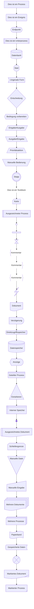

# `mermaid`-Samples (new shapes)

```mermaid
flowchart TD
    A@{ shape: rect, label: "Dies ist ein Prozess" }
    --> B@{ shape: rounded, label: "Dies ist ein Ereignis" }
    --> C@{ shape: stadium, label: "Endpunkt" }
    --> D@{ shape: subproc, label: "Dies ist ein Unterprozess" }
    --> F@{ shape: cyl, label: "Datenbank" }
    --> G@{ shape: circle, label: "Start" }
    --> H@{ shape: odd, label: "Ungerade Form" }
    --> I@{ shape: diamond, label: "Entscheidung" }
    --> J@{ shape: hex, label: "Bedingung vorbereiten" }
    --> K@{ shape: lean-r, label: "Eingabe/Ausgabe" }
    --> L@{ shape: lean-l, label: "Ausgabe/Eingabe" }
    --> M@{ shape: trap-b, label: "Prioritätsaktion" }
    --> N@{ shape: trap-t, label: "Manuelle Bedienung" }
    --> O@{ shape: dbl-circ, label: "Stopp" }
    --> P@{ shape: text, label: "Dies ist ein Textblock" }
    --> Q@{ shape: notch-rect, label: "Karte" }
    --> R@{ shape: lin-rect, label: "Ausgezeichneter Prozess" }
    --> S@{ shape: sm-circ, label: "Kleiner Start" }
    --> T@{ shape: fork, label: "Gabel oder Verknüpfung" }
    --> U@{ shape: hourglass, label: "Zusammenfügen" }
    --> V@{ shape: comment, label: "Kommentar" }
    --> W@{ shape: brace-r, label: "Kommentar" }
    --> X@{ shape: braces, label: "Kommentar" }
    --> Y@{ shape: bolt, label: "Kommunikationsverbindung" }
    --> Z@{ shape: doc, label: "Dokument" }
    --> AA@{ shape: delay, label: "Verzögerung" }
    --> AB@{ shape: das, label: "Direktzugriffsspeicher" }
    --> AC@{ shape: lin-cyl, label: "Datenspeicher" }
    --> AD@{ shape: curv-trap, label: "Anzeige" }
    --> AE@{ shape: div-rect, label: "Geteilter Prozess" }
    --> AF@{ shape: tri, label: "Extrahieren" }
    --> AG@{ shape: win-pane, label: "Interner Speicher" }
    --> AH@{ shape: f-circ, label: "Verbindung" }
    --> AI@{ shape: lin-doc, label: "Ausgezeichnetes Dokument" }
    --> AJ@{ shape: notch-pent, label: "Schleifengrenze" }
    --> AK@{ shape: flip-tri, label: "Manuelle Datei" }
    --> AL@{ shape: sl-rect, label: "Manuelle Eingabe" }
    --> AM@{ shape: docs, label: "Mehrere Dokumente" }
    --> AN@{ shape: processes, label: "Mehrere Prozesse" }
    --> AO@{ shape: flag, label: "Papierband" }
    --> AP@{ shape: bow-rect, label: "Gespeicherte Daten" }
    --> AQ@{ shape: cross-circ, label: "Zusammenfassung" }
    --> AR@{ shape: tag-doc, label: "Markiertes Dokument" }
    --> AS@{ shape: tag-rect, label: "Markierter Prozess" }

```
