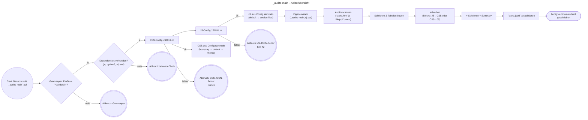

# Dokumentation – `_audits-main` – (v0.42.6)

Diese Dokumentation beschreibt Zweck, Verhalten und Schnittstellen des Skripts **`_audits-main`**. Das Skript erzeugt eine zentrale **TOC-/Übersichts-HTML** ("Audits – Übersicht") über vorhandene `latest.html`-Audits sämtlicher Audits-Skripte und gruppiert diese nach Kategorie (Präfix bis zum ersten Bindestrich im Skript-Namen).

---

## Zweck

* Zentrale Einstiegseite **`audits-main.html`** unter `~/code/bin/shellscripts/audits/audits-main.html`.
* Aggregation aller **`latest.html`** pro Skript und (optionalem) Kontext:
  `~/code/bin/shellscripts/audits/<script-id>/[<context>]/latest.html`
  (Kontexte z. B. `bin`, später auch Projekt-Kontexte.)
* Anzeige in einklappbaren Sektionen (**`<details>`**) nach **Kategorie** (Präfix des Skript-Namens).
* Spalten: **Script-Name**, **Context**, **Link to Page …**, **Kommentar**, **Status** (OK|WARN|ERR).

---

## Dateipfade & Artefakte

* **Ausgabe-HTML**: `~/code/bin/shellscripts/audits/audits-main.html`
* **Laufzeit-JSONL**: `~/code/bin/shellscripts/audits/_audits-main/<context>/latest.jsonl`
* **Debug/Xtrace**: `~/code/bin/shellscripts/debugs/_audits-main/` (z. B. `latest.xtrace.log`)
* **Run-Log**: `~/code/bin/shellscripts/.einspieler.txt`
* **Eigene Assets** (optional, leer angelegt):
  * `~/code/bin/shellscripts/audits/_audits-main/_audits-main.css`
  * `~/code/bin/shellscripts/audits/_audits-main/_audits-main.js`

!!!info **Spezialfall für dieses Skript:** `latest.jsonl` liegt **unter** `…/_audits-main/<context>/`, die **HTML** jedoch **global** unter `…/audits/audits-main.html`.

---

## Voraussetzungen

* Bash ≥ 5, `jq`, `python3`, `nl`, `sed`.
* Aufruf **aus** `~/code/bin` (Gatekeeper).
  Symlink: `~/code/bin/_audits-main` → `~/code/bin/shellscripts/_audits-main.sh`

---

## Aufruf & CLI-Optionen

```bash
_audits-main [--version] [--help]
             [--context=<name>]               # Standard: bin
             [--theme=dark|light|none]        # Standard: dark
             [--asset-order=js-first|css-first]  # Standard: js-first
             [--link-mode=relative|absolute]  # HREF-Modus, Standard: relative
             [--debug=xtrace|trace|dbg|all]   # Schreibt Xtrace-Log (latest.xtrace.log)
```

**Empfehlung:** `--asset-order=js-first` (JS-Block, dann CSS-Block) für deterministische Reihenfolge im `<head>`.

---

## Konfiguration (CSS/JS)

Konfigurationsdateien:

* CSS: `~/code/bin/templates/css/.css.conf.json`
* JS:  `~/code/bin/templates/js/.js.conf.json`

**Struktur (vereinfacht):**

```json
{
  "vars": {
    "css_root_bootstrap": "…/bootstrap-5.3.8-dist/css",
    "css_root_local": "…/themes",
    "css_default": "${css_root_bootstrap}/bootstrap.min.css",
    "css_audits_dark": "${css_root_local}/audits-dark.css",
    "js_default": "…/bootstrap.bundle.min.js"
  },
  "audits": {
    "_audits-main": {
      "bootstrap": "${css_root_bootstrap}/bootstrap.min.css",
      "css_audits_dark": "${css_root_local}/audits-dark.css",
      "files": [ ]
    }
  }
}
```

**Regeln:**

1. **Per-Skript-Override** (z. B. `audits["_audits-main"].bootstrap`) wird bevorzugt geladen.
2. Zusätzlich/Fallback wird **`vars.css_default`** geladen.
3. **Theme**: `audits[...].css_audits_dark|light` → sonst `vars.css_audits_dark|light` → oder `none`.
4. Danach (separate Blockreihenfolge im `<head>`): **`_audits-main.js` / `_audits-main.css`**.

**Pfadauflösung:** Platzhalter `${…}` werden **rekursiv** aus `vars` + Umgebung expandiert und zu **absoluten Pfaden** normalisiert.

**JSON-Lint:** Vor dem Laden wird die JSON-Syntax per `jq` geprüft. Bei Fehlern:

* Fehlermeldung mit Zeilennummer
* 5‑Zeilen-Kontextauszug
* Exit-Code **41** (CSS) / **42** (JS)

---

## Kommentar-Handling

* Kommentar wird aus `comment-bin-tree.txt` im **Ordner der gefundenen `latest.html`** gelesen.
* **Spezialfall**: Genau `"<span class=\"no-comment\">Noch kein Kommentar!</span>"` bleibt als HTML erhalten.
* **Whitelist** (für Kommentare): `<code>…</code>` (ohne Attribute) wird bewusst **nicht** escaped. Optional ebenfalls `<tt>`, `<br>` / `<br/>`.
* Alles andere wird **HTML-escaped** (XSS-Schutz).

---

## Scannen & Gruppieren

* Es werden ausschließlich folgende Orte gescannt:

  * `~/code/bin/shellscripts/audits/<script-id>/latest.html`
  * `~/code/bin/shellscripts/audits/<script-id>/<context>/latest.html`
* Kategorie = Präfix des Skript-Namens (bis zum ersten `-`), z. B. `_audits-main` → Kategorie `_audits`.
* **Duplikate** werden dedupliziert (Hardlink/Canonical-Pfad-Vergleich).

---

## Ausgabeformat

* `<details>` je Kategorie (geschlossen, `summary` = „Sektion: <category>“)
* Tabelle (Bootstrap, dunkles Theme, `table-sm`, `table-striped`, `table-hover`).
* **Footer** (optional): Badges/Meta (kann projektspezifisch ergänzt werden).
* **Summary-Block**: Kategorien, Skripte total, Kontexte, gefunden/fehlend, Duplikate.

---

## Logging & Backups

* **Run-Log**: `shellscripts/.einspieler.txt` (fortlaufend, inkl. Fehlerspuren).
* **Xtrace** (bei `--debug=xtrace|…`): `shellscripts/debugs/_audits-main/*.log`, Symlink `latest.xtrace.log`.
* **Installer-Backups**: `shellscripts/backups/_audits-main/…`
* **Rotation/Trash**: `trash/backups/_audits-main/` (für spätere systemd-Aufräumjobs).

---

## Fehlercodes (Auszug)

* **2**: Gatekeeper (falsches Arbeitsverzeichnis)
* **5**: fehlende Dependencies (`jq`, `python3`, `nl`, `sed`)
* **41/42**: JSON-Konfiguration fehlerhaft (CSS/JS)

---

## Best Practices

* **Keine Eigenmächtigkeiten**: Änderungen an Struktur/Konventionen immer abstimmen.
* Per-Skript-Assets („Overrides“) nur setzen, wenn notwendig – Default aus `vars` genügt oft.
* Bei Spaltenbreiten: `colgroup` + `table-layout: fixed` und flexibler Rest via `calc(...)` – siehe Hinweise im Projekt.

---

## Beispiel: Minimaler Lauf

```bash
cd ~/code/bin
_audits-main --asset-order=js-first --theme=dark --context=bin
xdg-open shellscripts/audits/audits-main.html
```

---

## Mermaid Flowchart (Ablauf)



---

!!!info **Hinweis zu Shapes:** Die Diagramm-Knoten verwenden die **Expanded Node Shapes** der neuen Mermaid-@-Syntax (v11.3+):
> `([runde Ecken])`, `{{Entscheidung}}`, `[[Prozess]]`, `/Eingabe/Ausgabe/`.

---

## Änderungsverlauf (Auszug)

* **v0.42.6**: JSON-Syntaxcheck mit Kontext-Ausgabe; gruppierte Asset-Blöcke im `<head>` beibehalten.
* **v0.42.5**: Asset-Reihenfolge blockweise (`--asset-order=js-first|css-first`).
* **v0.42.4**: Alle Assets konsistent im `<head>`; Config vor project-spezifischen Dateien.
* **v0.42.3**: Robuste Pfadauflösung via `vars`; kein Inline-CSS mehr.
* **v0.42.2**: Erst per-Skript-Bootstrap, dann Defaults; Theme-Overlay; deduplizierte HREFs; verbesserte Logs.
* **v0.42.x**: Whitelist für Kommentar-HTML (`<code>`, optional `<tt>`, `<br>`).

---

# Dokumentation (Update) – `_audits-main` – (v0.44.1)

Zentrale TOC-Seite für alle Audit-HTMLs unter `~/code/bin/shellscripts/audits/…`.
Erzeugt zusätzlich eine `latest.jsonl` (nur **für** `_audits-main`) als Lauf-Meta.

---

## Kurzüberblick

* **Arbeitsverzeichnis (Gatekeeper):** `~/code/bin` (ansonsten Abbruch).
* **Ziel-HTML:** `~/code/bin/shellscripts/audits/audits-main.html`.
* **JSONL (nur dieses Skript):** `~/code/bin/shellscripts/audits/_audits-main/<context>/latest.jsonl`.
* **Theming:** `dark|light|none` via `data-bs-theme` + optional Theme-CSS.
* **Assets aus Configs:**

  * CSS: `~/code/bin/templates/css/.css.conf.json`
  * JS:  `~/code/bin/templates/js/.js.conf.json`
  * Variablen-Auflösung inkl. `${vars}`-Platzhaltern (rekursiv), Defaults + pro-Skript-Overrides.
  * Reihenfolge per `--asset-order=js-first|css-first`.
  * Link-Modus: `relative` (Default) oder `absolute`.
* **Eigene Assets:**

  * `audits/_audits-main/_audits-main.css|.js` werden **immer** als letztes eingebunden (Tail).
* **TOC-Gruppierung:** nach Kategorie = Präfix im Skript-Namen bis zum ersten Bindestrich (z. B. `_audits-…` → Kategorie `_audits`).
  Jede Kategorie als `<details>`-Sektion mit Tabelle.
* **Kommentar-Quelle:** `comment-bin-tree.txt` im Ordner des jeweiligen `latest.html`
  (Fallback „Kein Kommentar!“, spezielle HTML-Schnipsel wie `<code>…</code>` werden erlaubt, übriges escaped).
* **Debug:** `--debug=dbg|trace|xtrace|all` → schreibt in `~/code/bin/shellscripts/debugs/_audits-main/*.log`
  Summary zeigt **vollständige Dateinamen** (mit `~`) + Level-Badge und **Anzahl** (1/3).

---

## CLI-Flags (Auszug)

<style>
  td { vertical-align: top; }
</style>

| Flag             | Wert(e)                   | Wirkung |
| ---------------- | ------------------------- | ------- |
| `--context` |`bin\|<project>` | Pfadanteil für JSONL-Ablage |
| `--theme`        | `dark\|light\|none` | HTML `<html data-bs-theme=…>` & Theme-CSS-Wahl |
| `--asset-order`  | `js-first\|css-first` | Einbaureihenfolge im `<head>` |
| `--link-mode`    | `relative` | `absolute`   | HREFs absolut/relativ |
| `--with-noise`   | `yes\|no` | steuert zusätzliche Terminal-Logs (zieht andere `with_*` mit) |
| `--with-assets`  | `yes\|no` | Asset-Logmeldungen ein/aus |
| `--with-options` | `yes\|no` | Konfig-Echo/ARGS-Log ein/aus |
| `--with-pages`   | `yes\|no` | Zusatzseiten-Logs (falls genutzt) |
| `--debug`        | `dbg\|trace\|xtrace\|all` | Debug-Modus/Dateien |
| `--version`      | –         | gibt Skriptversion aus |

**Priorität der Optionen:**
`defaults` (global) → `scripts["_audits-main"].defaults` → **CLI** (höchste Priorität).

---

## Konfigurationsdateien (Schemas)

* **CSS (`.css.conf.json`)**

  * `vars.css_default`: z. B. `${css_root_bootstrap}/bootstrap.min.css` (wird immer zusätzlich verlinkt, wenn vorhanden).
  * `vars.css_audits_dark` / `vars.css_audits_light`: Theme-Styles (optional).
  * `audits["_audits-main"].bootstrap` / `css_audits_dark|light`: pro-Skript-Overrides.
* **JS (`.js.conf.json`)**

  * `vars.js_default`: Basis-JS (optional).
  * `audits["_audits-main"].files[]`: zusätzliche JS-Dateien (array).

**Hinweise**

* Platzhalter `${name}` werden über `vars` + Umgebungsvariablen aufgelöst (rekursiv, begrenzt).
* JSON-Syntax wird geprüft (`jq -e .`);Invalides JSON → sauberer Abbruch mit Meldung.

---

## Ausgaben & Layout

* **Header `<h1>`:** `Audits – Übersicht - DD.MM.YYYY HH:MM:SS`
* **Tabellen-Spalten:**

  1. Script-Name (tt), 2. Context (`kein` oder Ordnername), 3. „Go to Page“ mit Link + 🔗, 4. Kommentar (HTML-safe), 5. Status-Badge `OK|WARN|ERR`
* **Summary (`<details class="toc-section">`):** Kategorien, Skripte total, Audits gefunden/fehlend, Gesamt, **Debug**:

  ```
  Debug  File(s): ~/…/_audits-main.xtrace.20251002-103012.log → xtrace → 1
  ```

  (bei `all`: bis zu 3 Pfade, durch „ + “ getrennt)

---

## Fehlerbehandlung & Logs

* Terminal-Ausgabe farbig (Material-Palette): `CFG`, `CSS`, `JS`, `OK`, `WARN`, `ERR`, `DEFAULT`, `JSONL`, `HTML`, `THEME`.
* Einspieler/Run-Log: `~/code/bin/shellscripts/.einspieler.txt`
* xtrace: `~/code/bin/shellscripts/debugs/_audits-main/_audits-main.xtrace.<TS>.log`
  Rotation: `debug_keep`/`debug_min_keep` (aus Options-Config).

---

## Mermaid-Flowchart (v11.3+ „Expanded Node Shapes“)

> Nutzt die **@-Syntax** für erweiterte Shapes (Beispiele: `rect`, `rounded`, `diamond`, `doc`, `cyl`, `term`, …).
> Docs: „Expanded Node Shapes in Mermaid Flowcharts (v11.3.0+)“. ([docs.mermaidchart.com][1])

```mermaid
flowchart TB

%% Nodes (using @-syntax)
Start@{shape: rounded, label: "Start / CLI"}
Gate@{shape: diamond, label: "pwd == ~/code/bin ?"}
Deps@{shape: rect, label: "need jq, python3, nl, sed"}
LoadOpts@{shape: doc, label: "Load .script-options.conf.json\nmerge defaults → script.defaults → CLI"}
Theme@{shape: hexagon, label: "theme/link-mode/\nasset-order/color"}
Xtrace@{shape: cyl, label: "--debug → enable_xtrace\nrotate keep/min_keep"}
CfgCSS@{shape: doc, label: "templates/css/.css.conf.json\nvalidate JSON"}
CfgJS@{shape: doc, label: "templates/js/.js.conf.json\nvalidate JSON"}
Expand@{shape: rect, label: "vars expand (${…})\nrelative HREFs"}
AssetsCSS@{shape: rect, label: "CSS:\naudits[sid].bootstrap\nvars.css_default\nvars|audits theme css"}
AssetsJS@{shape: rect, label: "JS:\nvars.js_default\naudits[sid].files[]"}
OwnTail@{shape: rect, label: "ensure audits/_audits-main/\n_audits-main.css + .js"}
Scan@{shape: rect, label: "scan audits/*[/<ctx>]/latest.html\n& comment-bin-tree.txt"}
Rows@{shape: rect, label: "build rows\nstatus badge\nsafe_comment()"}
Sections@{shape: rect, label: "group by category\n(details + table)"}
HTML@{shape: doc, label: "write audits-main.html\n<h1> with timestamp\nassets in selected order"}
JSONL@{shape: doc, label: "write _audits-main/<ctx>/latest.jsonl"}
Summary@{shape: rect, label: "Summary badges:\nKategorien/Skripte/Audits/Total\nDebug: File(s) → Level → N"}
End@{shape: term, label: "OK / Exit"}

%% Edges
Start --> Gate
Gate -- "No" --> End
Gate -- "Yes" --> Deps --> LoadOpts --> Theme --> Xtrace
Xtrace --> CfgCSS --> CfgJS --> Expand
Expand --> AssetsCSS --> AssetsJS --> OwnTail --> Scan --> Rows --> Sections --> HTML --> JSONL --> Summary --> End
```

*Anmerkung zu Shapes:* Die `@{ shape: …, label: "…" }`-Form ist die neue Kurzschreibweise für präzise Formen (v11.3+). Beispiele: `rect`, `rounded`, `diamond`, `cyl` (Zylinder), `doc` (Dokument), `term` (Terminator). ([docs.mermaidchart.com][1])

---

## Beispiele

```bash
# Standard (ruhig)
_audits-main

# Laut + Assets + Debug
_audits-main --with-noise=yes --with-options=yes --with-assets=yes --with-pages=yes --debug=xtrace

# Helle Variante, CSS zuerst, absolute Links
_audits-main --theme=light --asset-order=css-first --link-mode=absolute
```

---

## Troubleshooting (Kurz)

* **Kein Triangle im Summary:** `<details>` muss `class="toc-section"` tragen (konsistent zu Sektionen).
* **Bootstrap/Theme wird nicht geladen:** Pfade in `.css.conf.json` prüfen, Vars-Auflösung testen (Terminal-Logs `CFG`, `CSS`, `THEME` beachten).
* **Kommentare werden „literal“ angezeigt:** Nur whitelisted Tags (`<code>`, `<tt>`, `<br/>`, `<span class="no-comment">…</span>`) werden wiederhergestellt; Rest wird escaped.
* **Debug fehlt in Summary:** `--debug` setzen; bei `all` erscheinen bis zu **3** Dateien; Pfade werden mit `~` dargestellt.

---

Wenn du Details ergänzen willst (z. B. weitere Badges oder zusätzliche Summary-Metriken), sag Bescheid – ich passe die Doku + Diagramm direkt an.

[1]: https://docs.mermaidchart.com/mermaid-oss/syntax/flowchart.html?utm_source=chatgpt.com "Flowcharts – Basic Syntax"
