# Dokumentation – `_audits-check-css-path.sh`  (v0.25.1)

## Kurzzusammenfassung

Prüft CSS-Pfade, die in `templates/css/.css.conf.json` **sektionenweise** konfiguriert sind.
Löst `${vars}` aus `.css.conf.json` auf, verifiziert Datei-Existenz, schreibt **HTML/JSONL-Audits** (append) und rotiert Debug/Xtrace-Logs. UI ist **Bootstrap-Dark**, Tabellen sind **breit** (`container-fluid`), Spalten haben **Header-/Cell-Klassen** (`th-col-1..4`, `td-col-1..4`), Status als **Badges**.

## Features

* Gatekeeper: muss aus `~/code/bin` gestartet werden.
* Strikte Options-Config (`shellscripts/lib/.script-options.conf.json`) mit Schema-Validierung (kein Fallback; bei Fehler: Abbruch mit Meldung).
* CSS-Config-Parsing: `templates/css/.css.conf.json`
  * Verwendet `.vars` (Variablexpansion) + `.audits[<section>]` (Strings oder `files[]`).
* Ausgabe:
  * **Terminal**: kompakt; optional `--with-noise`, `--with-options`.
  * **HTML** (append → `shellscripts/audits/_audits-check-css-path/bin/latest.html`), Monatsrotation (`YYYY/YYYY-MM.html`).
  * **JSONL**: monatlich + `latest.jsonl`-Spiegel.
  * Automatisches Einfügen verlinkter **CSS** nur aus *eigener* `<script-id>`-Sektion + `_audits-check-css-path.css`.
* Debug:
  * `xtrace`/`all` schreiben `.jsonl`-Traces → Rotation nach `debug_keep`, `debug_min_keep`, `debug_age` (ältere wandern nach `~/code/bin/trash/debug/_audits-check-css-path`).
* Optional **Minify** (`html-minifier-terser`) je nach Options-Config.
* Link-Modus `relative|absolute` aus Options-Config (`link_mode`).

## CLI

```bash
_audits-check-css-path [--config=PATH] [--id=SEKTION]
                       [--debug=off|dbg|trace|xtrace|all]
                       [--debug-keep=N] [--debug-age=SPAN]
                       [--minify=yes|no]
                       [--with-noise] [--with-options|--options]
                       [--dump-raw] [--dump-resolved]
                       [--no-color] [--help] [--version]
```

### Wichtige Optionen

<style>
    td {vertical-align: top;}
</style>

| Option                       | Beschreibung                                |
| ---------------------------- | -------------------------------------------------------------------------------------- |
| `--config=PATH` | Pfad zur `.css.conf.json`<br/>(Default: `~/code/bin/templates/css/.css.conf.json`). |
| `--id=SEKTION` | nur diese Sektion verarbeiten (ohne: **alle**). |
| `--debug=off\|dbg\|trace\|xtrace\|all` | **Entwicklung** meist `xtrace`. |
| `--debug-keep=N` /<br/>`--debug-age=SPAN` | Rotation (z. B. `--debug-age=12h`). |
| `--minify=yes\|no` | HTML minifizieren (wenn Minifier vorhanden/konfiguriert). |
| `--with-noise` | ausführliche Terminal-Zwischenschritte. |
| `--with-options` | zeigt die effektiven Options-Werte im Terminal. |
| `--dump-raw` /<br/>`--dump-resolved` | zusätzliche Detailausgabe (impliziert `--with-noise`). |

!!!info **Hinweis:** `link_mode` (relative/absolute) ist nur in der **Options-Config** steuerbar, nicht via CLI.

## Konfiguration

### 1) CSS-Config (`.css.conf.json`)

```json
{
  "vars": {
    "HOME":      "$HOME",
    "css_root":  "${HOME}/code/bin/templates/css"
  },
  "audits": {
    "_audits-check-css-path": {
      "bootstrap": "${css_root}/bootstrap-5.3.8-dist/css/bootstrap.min.css",
      "custom": { "files": [
        "${css_root}/site/base.css",
        "${css_root}/site/print.css"
      ]}
    },
    "_lx-env": {
      "bootstrap": "${css_root}/bootstrap-5.3.8-dist/css/bootstrap.min.css"
    }
  }
}
```

* Erlaubt:
  * Einfache **String-Pfade** (werden aufgelöst),
  * oder **Objekte** mit `files` als String **oder** Array von Strings.
* Nicht erkannte Typen werden ignoriert. Fehlerhafte **JSON-Syntax** → sofortiger Abbruch mit Meldung (Zeile/Spalte/Snippet).

### 2) Options-Config (`shellscripts/lib/.script-options.conf.json`)

**Strikt** validiert; bei formalen/schematischen Fehlern Abbruch (kein Fallback).

```json
{
  "defaults": {
    "debug": "xtrace",
    "debug_keep": 5,
    "debug_min_keep": 2,
    "debug_age": "12h",
    "minify": "no",
    "link_mode": "relative",
    "minifier": {
      "bin": "html-minifier-terser",
      "args": ["--collapse-whitespace", "--remove-comments"]
    }
  },
  "scripts": {
    "_audits-check-css-path": {
      "defaults": {
        "debug": "xtrace",
        "minify": "yes",
        "link_mode": "relative"
      }
    }
  }
}
```

**Validierungsregeln (Auszug):**

* `debug`: `off|dbg|trace|xtrace|all`
* `debug_keep` / `debug_min_keep`: integer ≥ 2, und `min_keep ≤ keep`
* `debug_age`: Dauer `\d+[smhd]` (z. B. `30m`, `12h`, `2d`)
* `minify`: `yes|no`
* `link_mode`: `relative|absolute`

## Ausgaben & Layout

### Terminal (kompakt)

* Kopf mit Options-/CSS-Status (OK/ERR), Mode, Summaries.
* Optional `--with-noise` zeigt RAW/RES-Mengen und (bei Bedarf) resolved Pfade.

### HTML (append)

* Pfad: `shellscripts/audits/_audits-check-css-path/bin/latest.html`
* Bei Monatswechsel: älteres `latest.html` → `YYYY/YYYY-MM.html`.
* Struktur:
  * `<html data-bs-theme="dark">`
  * `<main class="container-fluid …">`
  * pro Lauf: `<details class="run card …">`
  * pro Sektion: `<details class="section card …">`
  * Tabelle: `table.audit.table.table-dark.table-striped.table-hover.table-sm.align-middle`
  * Header-Klassen: `th-col-1..4`; Zellen: `td-col-1..4`
    – **Spalte 3** bleibt flexibel; **Status** (Spalte 4) ist zentriert (`text-center`).
  * **CSS-Links**: nur CSS-Dateien aus **eigener** Skript-Sektion + `_audits-check-css-path.css`.

### JSONL

* Monatlich: `shellscripts/audits/_audits-check-css-path/bin/YYYY/YYYY-MM.jsonl`
* Spiegel: `…/latest.jsonl`
* Enthält `run_id`, `ts`, `config`, `script`, `summary` und `entries[]`.

### Debug / Rotation

* Xtrace-Logs: `shellscripts/debugs/_audits-check-css-path/*.jsonl`
* Rotation nach `debug_keep`, `debug_min_keep`, `debug_age`; **ältere** wandern nach `~/code/bin/trash/debug/_audits-check-css-path`.

## Abhängigkeiten

* **jq ≥ 1.6** (du hast `jq-1.7`, passt).
* **python3**
* Optional: **html-minifier-terser** (bei `minify: "yes"`).

## Exit-Codes (relevant)

* `0`  Erfolg
* `2`  Gatekeeper: falsches Arbeitsverzeichnis
* `3`  Unbekannte Option / fehlendes Tool
* `4`  CSS-Config nicht gefunden
* `5`  Sektion via `--id` nicht vorhanden
* `6`  Keine `.audits`-Sektionen im CSS-Config
* `7`  **CSS-Config JSON-Syntaxfehler** (mit Zeile/Spalte/Snippet)
* `8`  **Options-Config fehlt** (`shellscripts/lib/.script-options.conf.json`)
* `10` Options-Config fehlerhaft (Syntax/Schema/Overrides)
* `11` Minify fehlgeschlagen / Minifier nicht gefunden

## Beispiele

```bash
# Standardlauf (alle Sektionen)
_audits-check-css-path

# Nur eine Sektion
_audits-check-css-path --id=_audits-check-css-path

# Debug & Optionen sichtbar
_audits-check-css-path --with-options --debug=xtrace

# Extra Rauschen + Resolves anzeigen
_audits-check-css-path --with-noise --dump-resolved
```

---

## Mermaid-Flowchart (v13-Syntax)

```mermaid
%%{ init: { "theme": "", "flowchart": { "curve": "basis" } } }%%
flowchart TD
  Start@{ shape: stadium, label: "Start\n<tt>_audits-check-css-path</tt>" } --> Gatekeeper@{ shape: diamond, label: "Arbeitsverzeichnis == <tt>~/code/bin</tt>?" }
  Gatekeeper --- isNo1@{ shape: text, label: "nein" } --> Exit2@{ shape: rect, label: "Abbruch\nExit-Code 2" }
  Gatekeeper --- isYes1@{ shape: text, label: "ja" } --> LoadOpts@{ shape: rect, label: "Options-Config laden\n<tt>shellscripts/lib/.script-options.conf.json</tt>" }
  LoadOpts --> ValidateOpts@{ shape: diamond, label: "Syntax & Schema OK?" }
  ValidateOpts --- isNo2@{ shape: text, label: "nein" } --> Exit10@{ shape: rect, label: "Abbruch\nExit 10" }
  ValidateOpts --- isYes2@{ shape: text, label: "ja" } --> ParseArgs@{ shape: rect, label: "CLI-Argumente verarbeiten\n(debug, id, minify, ...)" }
  ParseArgs --> CssCfg@{ shape: rect, label: "CSS-Config laden\n<tt>templates/css/.css.conf.json</tt>" }
  CssCfg --> ValidateCss@{ shape: diamond, label: "JSON-Syntax OK?" }
  ValidateCss --- isNo3@{ shape: text, label: "nein" } --> Exit7@{ shape: rect, label: "Abbruch\nExit 7" }
  ValidateCss --- isYes3@{ shape: text, label: "ja" } --> CollectSecs@{ shape: rect, label: "Sektionen ermitteln\n(<tt>--id</tt> oder <tt>alle</tt>)" }
  CollectSecs --> InitCounters@{ shape: rect, label: "Zähler initialisieren\n<tt>ok=0, err=0, total=0</tt>" }
  InitCounters --> ForEachSec@{ shape: rect, label: "Für jede Sektion" }
  ForEachSec --- isIterate@{ shape: text, label: "iteriert" } --> ExtractPairs@{ shape: rect, label: "Paare extrahieren\nStrings + <tt>files[]</tt>" }
  ExtractPairs --> ResolveVars@{ shape: rect, label: "Variablenauflösung\n<tt>.vars</tt> + <tt>$HOME</tt>" }
  ResolveVars --> CheckFiles@{ shape: rect, label: "Existenz prüfen\n<tt>isfile</tt>?" }
  CheckFiles --> Accumulate@{ shape: rect, label: "Zähler & Tabellenzeilen sammeln" }
  Accumulate --> NextPair@{ shape: diamond, label: "Weitere Paare?" }
  NextPair --- isNo4@{ shape: text, label: "nein" } --> NextSec@{ shape: diamond, label: "Weitere Sektionen?" }
  NextPair ---  isYes4@{ shape: text, label: "ja" } --> ResolveVars
  NextSec --- isNo5@{ shape: text, label: "nein" } --> BuildCssLinks@{ shape: rect, label: "CSS-Linkblock bauen\n(nur eigene Sektion + script CSS)" }
  NextSec --- isYes5@{ shape: text, label: "ja" } --> ExtractPairs
  BuildCssLinks --> UpdateLatest@{ shape: rect, label: "<tt>latest.html</tt> öffnen/erzeugen\nMonatsrotation bei Bedarf" }
  UpdateLatest --> AppendRun@{ shape: rect, label: "Run-Card + Section-Tables anhängen" }
  AppendRun --> MaybeMinify@{ shape: diamond, label: "Minify aktiviert?" }
  MaybeMinify --- isYes6@{ shape: text, label: "ja" } --> RunMinifier@{ shape: rect, label: "<tt>html-minifier-terser</tt> ausführen" }
  MaybeMinify --- isNo6@{ shape: text, label: "nein" } --> SkipMinify@{ shape: rect, label: "Minify übersprungen"}
  RunMinifier --> WriteJSONL@{ shape: rect, label: "JSONL Append\nmonthly + <tt>latest.jsonl</tt>"}
  SkipMinify --> WriteJSONL
  WriteJSONL --> RotateDebugs@{ shape: rect, label: "Debug-Rotation\n(<tt>debug_keep</tt>/<tt>min_keep</tt>/<tt>age</tt>)"}
  RotateDebugs --> Done@{ shape: stadium, label: "Fertig: Exit 0"}
```



---
