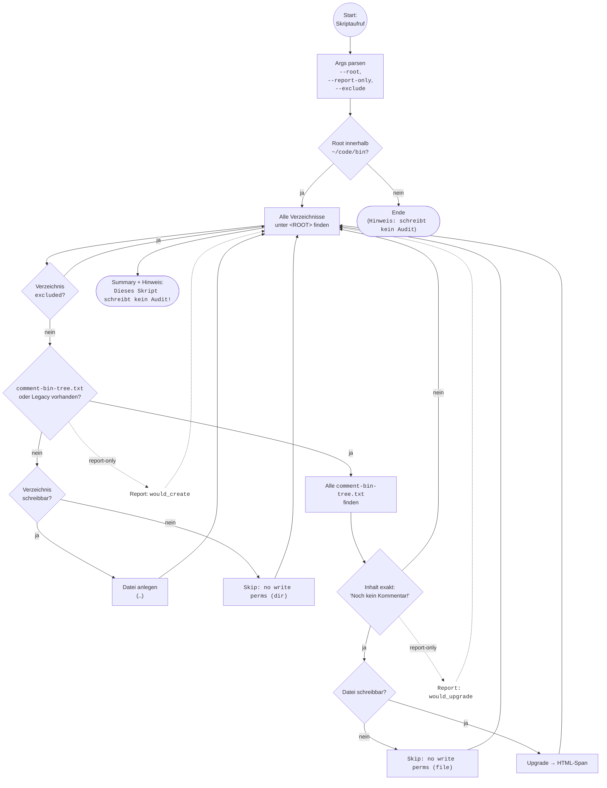

# Dokumentation – `_bin-no-comment-txt.md` (v0.4.0)

## `_bin-no-comment-txt` — Kommentarplatzhalter in Ordnern anlegen (v0.4.0)

**Kurzbeschreibung:**
Legt in allen Verzeichnissen unter einem Root (Default: `~/code/bin`) eine `comment-bin-tree.txt` an, falls dort noch **keine** existiert.
Neue Dateien enthalten den HTML-Platzhalter `<span class="no-comment">Noch kein Kommentar!</span>`.
Bestehende `comment-bin-tree.txt` mit EXAKT `Noch kein Kommentar!` werden auf den HTML-Platzhalter **migriert**.

!!!info Hinweis: Dieses Skript schreibt **kein Audit**.

## Verwendung
```bash
_bin-no-comment-txt                     # Standard-Root = ~/code/bin
_bin-no-comment-txt --report-only       # Nur Bericht (keine Änderungen)
_bin-no-comment-txt --root=/abs/pfad    # Muss innerhalb von ~/code/bin liegen
_bin-no-comment-txt --exclude='*/.git/*' --exclude='*/node_modules/*'
```

## Verhalten

* **Nicht zerstörerisch:** vorhandene `comment-bin-tree.txt` und etwaige `comment-bin.tree.txt` (Legacy) werden **nicht überschrieben**.
* **Migration:** Nur Dateien mit **exaktem** Inhalt `Noch kein Kommentar!` werden geändert.
* **Rechte:** Fehlt Schreibrecht, wird sauber **geskippt** (keine Abbrüche).
* **Report:** `--report-only` listet, was **würde** passieren (inkl. Meta: Owner, Modus, ACL, immutable).

## Exit-Codes

* `0` Erfolg (inkl. report-only)
* `3` Root außerhalb `~/code/bin`
* `>0` andere Fehler (z. B. Tools fehlen)

## Beispiele

```bash
# Nur anzeigen, was unter ~/code/bin passieren würde
_bin-no-comment-txt --report-only

# Nur unter audits arbeiten:
_bin-no-comment-txt --root="$HOME/code/bin/shellscripts/audits"

# Komplettlauf, aber Repos-Metaverzeichnisse auslassen
_bin-no-comment-txt --exclude='*/.git/*' --exclude='*/.cache/*' --exclude='*/node_modules/*'
```

## Flowchart



---
