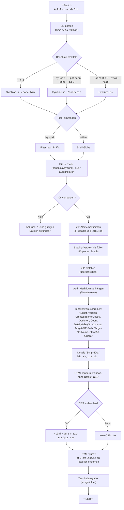

# `_sh-zip-scripts` — Dokumentation (v0.3.5)

Ein Hilfsskript zum schnellen Bündeln von Shellskripten aus `~/code/bin/shellscripts` in **eine** ZIP-Datei – mit sauberem **Audit** (Markdown + HTML), reproduzierbarer **Run-Id** und klarer **Terminalausgabe**.

---

## TL;DR

* **Aufruf:** `_sh-zip-scripts [Optionen]`   *(aus `~/code/bin` heraus)*
* **Quelle der Auswahl:** Symlinks in `~/code/bin` (IDs = Symlink-Namen)
* **Ziel:** `~/code/bin/shellscripts/runs/bin/sh-zip-scripts/<name>.zip` *(immer überschrieben)*
* **Audit:** `~/code/bin/shellscripts/audits/sh-zip-scripts/latest.md|.html`
* **HTML:** ohne Pandoc-Default-CSS; optionales CSS nur, wenn `sh-zip-scripts.css` bereits existiert

---

## Voraussetzungen

* Verzeichnislayout:

  * Skripte: `~/code/bin/shellscripts/*.sh`
  * Symlinks: `~/code/bin/<script-id>` → `shellscripts/<script-id>.sh`
* Tools: `zip`, `awk`, `sed`, `perl`, `sha256sum`, `pandoc`
* **Arbeitsverzeichnis:** Das Skript **muss** aus `~/code/bin` gestartet werden.

---

## Installation & Aufruf

* Kanonische Datei: `~/code/bin/shellscripts/_sh-zip-scripts.sh`
* Öffentlicher Aufruf (Symlink): `~/code/bin/_sh-zip-scripts`
* Optional (wenn von dir angelegt): weiterer Alias ohne Unterstrich `~/code/bin/sh-zip-scripts`

**Beispiel:**

```bash
cd ~/code/bin
_sh-zip-scripts --version
```

---

## Auswahl-Logik (IDs → Dateien)

**Basisliste (IDs):**

* `--all` → **alle** Symlinks in `~/code/bin`
* `--by-cat` / `--pattern` → bauen **automatisch** die Basisliste aus Symlinks, auch **ohne** `--all`
* `--scripts` / `--from-file` → **explizite IDs** (überschreiben die Basisliste)

**Filter:**

* `--by-cat=<c1,c2>` → Kategorie = Präfix vor dem ersten `-` in der ID (z. B. `_sh`, `git`)
* `--pattern=<p1,p2>` → Shell-Globs auf IDs (z. B. `git-*`, `_sh-*`)
* Kombination `--all` + `--pattern` → **Hinweis**: `--pattern` hat Vorrang (auch für die ZIP-Benennung)

**Pfadauflösung (Quelle):**

* `--src=canonical` (Default) → echte Dateien unter `shellscripts/`
* `--src=symlink` → Auflösung über Symlinks

---

## ZIP-Benennung (automatisch)

* **Alle Skripte:** `sh-zip-scripts-all.zip`
* **Genau 1 Kategorie:** `sh-zip-scripts-<cat>.zip`
* **Genau 1 ID:** `sh-zip-scripts-<id>.zip`
* **Gemischt:** `sh-zip-scripts-mixed.zip`

!!!info Wenn `--pattern` genutzt wird, **überschreibt** es `--all` auch bzgl. Name.

---

## Optionen (mit Defaults & Kurzbeschreibung)

<style>
  td { vertical-align: top; }
</style>

| Option  | Wert(e) | Default | Erklärung |
| ------- | ------- | ------- | --------- |
| `--all` | | aus | Basisliste = alle Symlinks in `~/code/bin`. |
| `--scripts | `<script-ID1>,[<script-ID2>]` | — | Explizite IDs (z. B. `_sh-zip-scripts,_sh-logger-inject`). |
| `--from-file` | `PFAD` | — | Eine ID je Zeile (ignoriert Leerzeilen). |
| `--pattern` | `GLOB[,GLOB…]` | — | Shell-Globs auf IDs (z. B. `git-*`, `_sh-*`). Baut bei Bedarf Basisliste. |
| `--by-cat=CAT[,CAT…]` | — | Kategorien filtern (Präfix vor erstem `-`, z. B. `_sh`, `git`). Baut bei Bedarf Basisliste. |
| `--src` | `canonical` \|<br/>`symlink` | `canonical` | Pfadauflösung der Quelldateien. |
| `--with-libs=none\|auto\|all` | `none` | Platzhalter (derzeit ohne Funktion). |
| `--with-docs` | | aus | Platzhalter (derzeit ohne Funktion). |
| `--with-changelogs` | | aus | Platzhalter (derzeit ohne Funktion). |
| `--html-inline` | `keep\|pure` | `pure` | `pure` entfernt `style/class/id` an Tabellen in der HTML-Ausgabe. |
| `--dry-run` | | aus | Zeigt nur Ziele/Dateien an, schreibt nichts. |
| `--debug` | `OFF\|dbg\|trace\|xtrace` | `OFF` | Interne Debug-Level. |
| `--help`, `--version` | | — | Hilfe bzw. Version ausgeben. |

---

## Terminalausgabe (ausgerichtet)

Beispiel:

```
target(s): ~/code/bin/shellscripts/...
zip:   overwrote:  /runs/bin/sh-zip-scripts/sh-zip-scripts-all.zip
md:    appended:   /audits/sh-zip-scripts/latest.md
html:  overwrote:  /audits/sh-zip-scripts/latest.html
css:   linked-ok   /audits/sh-zip-scripts/sh-zip-scripts.css
```

* Pfade ab `shellscripts/` relativ dargestellt.
* `css:` ist `linked-ok`, falls `sh-zip-scripts.css` existiert, sonst `none`.

---

## Audit-Ausgaben

**Markdown:** `~/code/bin/shellscripts/audits/sh-zip-scripts/latest.md`
**HTML:** `~/code/bin/shellscripts/audits/sh-zip-scripts/latest.html`
**Eigenschaften:**
* **Monatsweise** Append in `latest.md` mit Abschnitt `## YYYY-MM`
* **Header H1 (HTML Title):** `Audit _sh-zip-scripts — YYYY-MM-DD HH:MM:SS CEST`
* **Subheader `<h2>`:** `~/code/bin/shellscripts/_sh-zip-scripts.sh - vX.Y.Z`
* **Kein** Pandoc-Default-CSS; optionaler Link auf `sh-zip-scripts.css`, **nur wenn vorhanden**
* **Run-Id / Created:** ohne Zeitzonen-Offset (`YYYYMMDD-HHMMSS` / `YYYY-MM-DD HH:MM:SS`)

### Tabellenschema

<style>
  td:nth-child(1) { width: 8rem; }
</style>

| Spalte | Inhalt  |
| ------ | ------- |
| Script | Immer `` `_sh-zip-scripts` `` |
| Version | `vX.Y.Z` |
| Created | `YYYY-MM-DD HH:MM:SS` *(ohne Offset)* |
| Optionen  | **Nur die vom Nutzer übergebenen** Options-Tokens (beginnend mit `-`), `--` wird als **Nicht-Trennstrich** dargestellt; bei **>1** Option **`<br/>`** als Trenner. |
| Dateigröße (zip) | SI-Einheiten (1000er) mit **1 Dezimalstelle**, **Komma** als Dezimaltrennzeichen (z. B. `17,0 MB`) |
| Target-ZIP-Path | **Nur Ordnerpfad** relativ ab `shellscripts/` (z. B. `/runs/bin/sh-zip-scripts`) |
| Target-ZIP-Name | ZIP-Dateiname (z. B. `sh-zip-scripts-all.zip`) |
| SHA256          | Checksumme des ZIP |
| Quelle          | `canonical` oder `symlink` |

### Script-IDs (unter der Tabelle)

Ein `<details>`-Block:

```html
<details><summary>Script-IDs</summary>
`id1.sh`; `id2.sh`; `id3.sh`
</details>
```

* **Semikolon-getrennt**, jede ID als Code-Span.
* **Kein** Command-Substitution-Risiko (Backticks werden korrekt als Zeichen ausgegeben).

---

## Beispiele (häufige Aufrufe)

```bash
# Alle Skripte (Symlinks) packen
_sh-zip-scripts --all

# Nach Kategorie (_sh)
_sh-zip-scripts --by-cat=_sh

# Nur git-bezogene Skripte (Pattern baut Basisliste selbst)
_sh-zip-scripts --pattern=git-*

# Mehrere Patterns + Kategorien
_sh-zip-scripts --pattern=_sh-*,git-* --by-cat=_sh,git

# Explizite IDs
_sh-zip-scripts --scripts=_sh-zip-scripts,_sh-logger-inject

# IDs aus Datei (eine ID je Zeile)
_sh-zip-scripts --from-file=ids.txt

# Trockendurchlauf (zeigt nur Ziele)
_sh-zip-scripts --dry-run
```

---

## Troubleshooting

* **„Dieses Skript muss aus ‘\~/code/bin’ gestartet werden.“**
  → In `~/code/bin` wechseln: `cd ~/code/bin`.
* **„Keine gültigen Dateien gefunden.“**
  → Existieren Symlinks in `~/code/bin`? Stimmen ID-Namen, `--pattern` oder `--by-cat`?
  → Zur Diagnose: `--dry-run`.
* **HTML ohne Styles:**
  → `sh-zip-scripts.css` im Audit-Ordner ablegen; wird dann automatisch verlinkt.
  → CSS wird **nicht** überschrieben.
* **Falscher ZIP-Name:**
  → Beachte: `--pattern` **überschreibt** `--all` bzgl. Auswahl **und** ZIP-Benennung.

---

## Verzeichnisstruktur (relevant)

```
~/code/bin/
├─ _sh-zip-scripts           # Symlink → shellscripts/_sh-zip-scripts.sh
├─ <andere Symlinks>         # IDs: git-..., _sh-..., usw.
└─ shellscripts/
   ├─ _sh-zip-scripts.sh     # Kanonisches Skript
   ├─ runs/bin/sh-zip-scripts/
   │  └─ sh-zip-scripts-*.zip
   ├─ audits/sh-zip-scripts/
   │  ├─ latest.md
   │  ├─ latest.html
   │  └─ sh-zip-scripts.css  # optional, wenn vorhanden
   ├─ debugs/sh-zip-scripts/
   └─ backups/_sh-zip-scripts/
```

---

## Mermaid-Flowchart (Ablauf)



---

## Versionierung

* Die aktuell dokumentierte Logik entspricht **v0.3.5**:

  * **Run-Id** und **Created** **ohne** Offset
  * Optionen-Spalte: **nur Nutzer-Args**, `--` als nicht umbrechbarer Strich, bei >1 Option `<br/>`
  * Target-Spalten getrennt in **Path** und **Name**
  * Details-Block: **„Script-IDs“**, Ausgabe als `` `id.sh` `` mit **Semikolon**-Trennung
  * HTML „pure“, kein Pandoc-Default-CSS, optionaler CSS-Link

---
