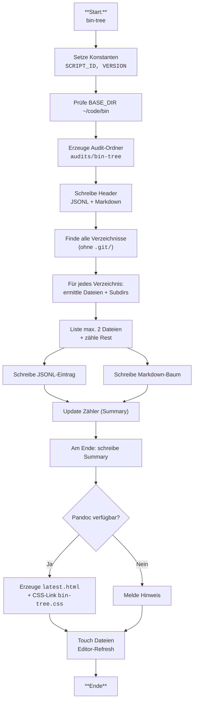

# Dokumentation: `bin-tree`

## Übersicht

Das Skript **`bin-tree`** (aktuell **v0.3.2**) erstellt eine baumartige Übersicht des Verzeichnisses `~/code/bin` und seiner Unterordner.
Es dient dazu, eine **stark reduzierte Sicht** auf die Struktur zu erhalten:

* Je Verzeichnis werden **maximal zwei Dateien** (alphabetisch sortiert) angezeigt.
* Weitere Dateien werden nur gezählt und als **Summary-Eintrag** vermerkt.
* `.git/`-Ordner werden konsequent **ignoriert**.

Die Ergebnisse werden maschinenlesbar (JSONL), menschenlesbar (Markdown) und als HTML-Report (Pandoc + CSS) abgelegt.

---

## Zweck

* Auditieren der Struktur von `~/code/bin`.
* Vereinfachte Übersicht (ähnlich `tree`), ohne dabei von zu vielen Dateien überflutet zu werden.
* Automatisches Erzeugen von Audit-Artefakten in standardisierten Ausgabedateien.

---

## Aufruf

```bash
bin-tree [OPTION]
```

Beispiele:

```bash
# Standardaufruf (kein Argument) → schreibt latest.jsonl, latest.md, latest.html
bin-tree

# Version anzeigen
bin-tree --version

# Hilfe anzeigen
bin-tree --help
```

---

## Optionen

Verfügbare Optionen:

* `--help`  Zeigt die Hilfeseite an und beendet das Skript.
* `--version` Zeigt die aktuelle Version des Skripts an und beendet es.

Nicht vorhandene Standard-Optionen (die bei anderen Skripten üblich sind):

* **`--dry-run`** (nicht nötig, da keine destruktiven Aktionen stattfinden).
* **`--yes`** (keine interaktive Bestätigung notwendig).
* **`--allow-dirty`** (kein Git-Working-Tree-Kontext).
* **`--debug=…`** (kein Debug-/Trace-/Xtrace-Modus).
* **`--json`** / **`--summary-only`** (es wird immer JSONL + Markdown + HTML erzeugt).
* **`--no-color`** (Farbausgabe nicht relevant).

---

## Ausgaben

Das Skript erzeugt immer drei Dateien im Verzeichnis:
`~/code/bin/shellscripts/audits/bin-tree/`

* **`latest.jsonl`**
  Enthält maschinenlesbare Zeilen im JSONL-Format.

  * Header: `{"header":"bin-tree - 2025-09-22T17:50:23+0200 - Audit"}`
  * Subheader: `{"subheader":"/voller/pfad/zum/bin-tree.sh - v0.3.2"}`
  * Einträge je Verzeichnis mit Feldern:

    * `dir`: Relativer Ordnerpfad (Root = `bin/`)
    * `files`: Array der max. 2 Dateien
    * `files_more`: Anzahl der weiteren Dateien im Ordner
    * `subdirs`: Anzahl der Unterordner
  * Abschließend ein `summary`-Objekt.

* **`latest.md`**
  Markdown-Report für direkte Ansicht in Editoren.

  * Header: `# Audit \`bin-tree\` — YYYY-MM-DD HH\:MM\:SS CEST\`
  * Subheader: `## /voller/pfad/bin-tree.sh - v0.3.2`
  * Baumdarstellung:

    * Ordner: **fett**, mit `/` und 📁
    * Dateien: *kursiv*
  * Am Ende ein **Summary**, die Werte sind fett hervorgehoben.

* **`latest.html`**

  * Wird mit Pandoc aus `latest.md` erzeugt.
  * Enthält `<link rel="stylesheet" href="bin-tree.css">` zur Einbindung eines Stylesheets.
  * Kein Pandoc-Default-CSS.

---

## Besonderheiten

* Root-Verzeichnis wird als **`bin/`** ausgegeben, nicht als `.`.
* Im Markdown werden nur die **Ordnernamen (Basenames)** angezeigt, nicht ganze Pfade.
* Summary-Werte im Footer sind **fett** formatiert.
* Script arbeitet **ohne** Debugging, Dry-Run oder interaktive Bestätigung → sehr einfach.
* HTML-Ausgabe erfordert lokal installiertes **Pandoc**. Wenn nicht verfügbar, wird ein Hinweis ausgegeben.

---

## Beispielausgabe (Markdown, gekürzt)

```markdown
# Audit `bin-tree` — 2025-09-22 18:00:00 CEST
## /home/gunreip/code/bin/shellscripts/bin-tree.sh - v0.3.2

- **bin/** 📁
  - *git-push*
  - *git-pull*
  - … 5 weitere Datei(en)
  - **shellscripts/** 📁
    - *bin-tree.sh*
    - … 42 weitere Datei(en)

## Summary
- total_dirs: **12**
- total_files: **128**
- total_files_listed: **24**
- total_files_more: **104**
```

---

## Flowchart - bin-tree



---
