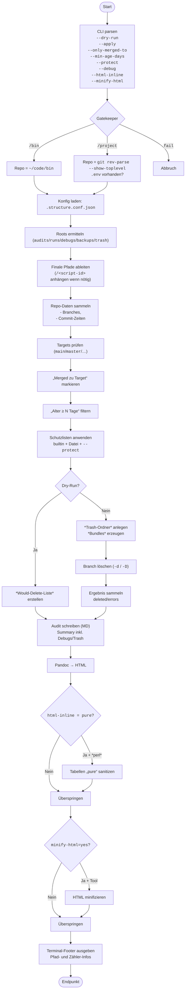

# Dokumentation: `git-branch-prune-local` (v0.4.1)

## Kurzbeschreibung:

Löscht **lokale**, bereits **gemergte** Git-Branches nach Regeln: Ziel-Branch (`--only-merged-to`), Mindestalter (`--min-age-days`), Schutzlisten (built-in + Datei), **Dry-Run**-Vorschau, sichere **Trash-Bundles**, monatliches **Audit** als Markdown/HTML, optionales **HTML-Minify**, sowie **Debug-Logs**.

Aktuelle Skript-Version: **v0.4.1**
Skriptpfad (kanonisch): `~/code/bin/shellscripts/git-branch-prune-local.sh`
Symlink in `~/code/bin/`: `git-branch-prune-local`

---

## Features

* **Gatekeeper**: Ausführung **nur** aus `~/code/bin` (eigenes Repo) **oder** aus einem Projekt-Repo-Root (erfordert `.env` im Repo).
* **Ziel-Branch/Alter**: löscht nur, wenn *gemergt in* `main/master/<…>` **und** älter als N Tage.
* **Schutzlisten**: Built-in-Exakt/Globs, zusätzliche Globs via `--protect` oder Datei `.git-prune-protect`.
* **Dry-Run**: zeigt *Would-Delete* & *Would move to Trash*.
* **Sicheres Löschen**: erzeugt pro Branch ein Git-**Bundle** im Trash-Pfad; erst dann `git branch -d` (oder `-D` mit `--force-delete`).
* **Audits**: `latest.md` (monatlich gegliedert, je Run ein `<details>`-Abschnitt) & `latest.html` (Pandoc, optional minified).
* **Tabellen ohne Inline-Styles**: HTML kann auf „pure“ Sanitizing gesetzt werden (`--html-inline=pure`).
* **Debug-Logs**: `--debug=dbg|trace|xtrace` schreibt Logs in `…/debugs/git-branch-prune-local/…` und verlinkt im Audit („Summary → Debugs“).
* **Struktur-Konfiguration** via `~/code/bin/.structure.conf.json`.

---

## Voraussetzungen

* **Git** (lokale Branch-Operationen, Bundles)
* **Pandoc** (für HTML-Export; Markdown wird immer geschrieben)
* **Perl** *(optional)* für „pure“-Tabellen-Sanitizing
* **html-minifier-terser** *(optional)* für HTML-Minify (empfohlen)

---

## Ausführungskontext (Gatekeeper)

* **Modus „bin“**: Ausführung aus `~/code/bin` (dieses Verzeichnis muss ein Git-Repo sein).
* **Modus „project“**: Ausführung aus einem **Repo-Root** (via `git rev-parse --show-toplevel` erkannt) **mit** Datei `.env`.
* **Abbruch**, wenn:
  * Kein Git-Repo,
  * nicht aus Repo-Root gestartet,
  * oder `.env` fehlt (im Projektmodus).

---

## Ordnerstruktur & Konfiguration

Standard-Roots (ohne `.structure.conf.json`):

```bash
~/code/bin/shellscripts/...
  ...audits/git-branch-prune-local/
  ...runs/git-branch-prune-local/
  ...debugs/git-branch-prune-local/
  ...backups/git-branch-prune-local/
  ...trash/git-branch-prune-local/
```

Du kannst die Struktur per **`~/.structure.conf.json`** (genauer: `~/code/bin/.structure.conf.json`) anpassen:

```json
{
  "version": 1,
  "vars": {
    "shellscripts_root": "$HOME/code/bin/shellscripts"
  },
  "jobs": {
    "audits":   "${shellscripts_root}/audits",
    "runs":     "${shellscripts_root}/runs",
    "debugs":   "${shellscripts_root}/debugs",
    "backups":  "${shellscripts_root}/backups",
    "trash":    "${shellscripts_root}/trash"
  },
  "html": {
    "inline": "pure",   // "pure" = HTML-Tabellen ohne class/id/style; "keep" = unverändert
    "minify": "yes"     // "yes" oder "no"
  }
}
```

**Anmerkungen:**

* Platzhalter `${HOME}`, `$HOME`, `${shellscripts_root}`, `${script_id}` sind erlaubt.
* Das Skript hängt die **`/<script-id>`-Ebene** (hier: `git-branch-prune-local`) **nur** an, wenn sie im Job-Root **nicht** bereits vorhanden ist und **kein** `${script_id}`-Platzhalter verwendet wird.

---

## Schutzlisten

* **Built-in (exakt):** aktueller Branch, `HEAD`, `main`, `master`, `develop`
* **Built-in (Globs):** `release/*`, `hotfix/*`, `wip/*`, `prod*`, `staging*`
* **Datei-basiert:** Jede Zeile in `.git-prune-protect` (im Repo-Root) ist ein Glob-Muster, `#` startet Kommentare.
* **Ad-hoc:** `--protect='globa,globb,globc'` (Komma-separiert)

---

## Optionen

<style>
    td {vertical-align: top;}
</style>

| Option                       | Beschreibung                                |
| ---------------------------- | -------------------------------------------------------------------------------------- |
| `--help` / `--version`       | Kurzhilfe / Versionsausgabe |
| `--dry-run`                  | (Default) **Nichts löschen**, nur zählen/auflisten und Audit schreiben. |
 `--apply`                     | **Löschen aktiv**: Bundles erzeugen, `git branch -d` (oder `-D` per `--force-delete`). |
| `--force-delete`             | Nutzt `git branch -D` statt `-d` (nur zusammen mit `--apply` sinnvoll). |
| `--only-merged-to=<t1,t2,…>` | Liste der Target-Branches (Default: `main` → Fallback `master`, wenn `main` fehlt). |
| `--min-age-days=N`           | Mindestalter in Tagen seit letztem Commit (Default: `7`). |
| `--protect=<glob1,glob2,…>`  | Zusätzliche Schutz-Globs (Komma-separiert). |
| `--html-inline=keep\|pure` | `pure`: entfernt `class/id/style` aus Tabellen-Tags (wenn `perl` vorhanden), sonst `keep`. |                                    |
| `--minify-html=yes\|no` | Minifiziert `latest.html` mit `html-minifier-terser` (falls installiert). |
| `--debug=dbg\|trace\|xtrace\` | Debug-Logs erzeugen (siehe unten). |

---

## Dry-Run vs. Apply

* **Dry-Run**:

  * Kandidaten werden ermittelt, in Audit als *Would-Delete* und *Would move to Trash (bundles)* angezeigt.
  * **Keine** Änderungen an Git-Branches.
* **Apply**:

  * Für jeden Kandidaten wird zuerst ein **Bundle** im Trash-Pfad erzeugt:
    `…/trash/git-branch-prune-local/<repo>/<run-id>/<branch>.bundle`
  * Anschließend Löschen mit `git branch -d` (oder `-D` mit `--force-delete`).
  * Fehler (z. B. fehlgeschlagene Bundle-Erzeugung) werden gezählt und im Audit ausgewiesen.

---

## Debugging

`--debug=` erzeugt Dateien in `…/debugs/git-branch-prune-local/`:

* `dbg`: `<id>.dbg.<ts>` — kompakte Timestamp-Logs (eigene `dbg`-Events)
* `trace`: `<id>.trace.<ts>` — **Shell-Trace** via `trap DEBUG` (jede ausgeführte Zeile)
* `xtrace`: `<id>.xtrace.<ts>` — `set -x` mit `BASH_XTRACEFD` (klassisches XTrace)

Die Pfade werden:

* im **Terminal-Footer** angezeigt (`dbg:/trace:/xtrace:`)
* im **Audit** unter **Summary → Debugs** (Semikolon-getrennt, `<code>…</code>`)

---

## Audit-Artefakte

* **Markdown:** `…/audits/git-branch-prune-local/latest.md`

  * **Monatliche Sektionen:** `## YYYY-MM`
  * Pro Run ein `<details class="run"><summary>Run-Id: <ts></summary> … </details>`
  * **Tabelle** mit Spalten:
    `Script | Version | Created | Optionen | Repo | Target | Min-Age (d) | Found | Eligible | Deleted/Would | Kept-prot | Kept-recent | Kept-unmerged | Errors`
  * **Summary-Block** (als `<details class="details-list">`) mit Unterpunkten:

    * Would-Delete *(oder Deleted)*
    * Would move to Trash *(oder Moved to Trash)*
    * Kept (protected / recent / unmerged)
    * **Debugs** *(neu; inert, wenn kein Debug aktiv)*
    * Structure-Config *(Version/mtime)*
  * Leere Punkte erhalten das Attribut **`inert`**.
* **HTML:** `…/audits/git-branch-prune-local/latest.html`

  * Titel: `Audit git-branch-prune-local — <Datum/Zeit TZ>`
  * Subheader: `## ~/code/bin/shellscripts/git-branch-prune-local.sh - vX.Y.Z {#git-branch-prune-local-subheader}`
  * CSS: `…/audits/git-branch-prune-local/git-branch-prune-local.css` (nur **erstellt**, wenn **nicht** vorhanden)
  * Optional: **minified** (Status im Terminal-Footer unter `html-min:`)

---

## Rückgabecodes (Exit Codes)

* `0` — Erfolg
* `2` — Gatekeeper/Umgebung fehlerhaft (kein Repo, kein .env, falsches Arbeitsverzeichnis, fehlende Roots)
* `3` — Ungültige Optionen oder Syntaxfehler in Parametern
* `>0` — Laufzeitfehler (z. B. Git-Fehler, I/O), werden im Audit als `Errors` gezählt

---

## Häufige Beispiele

```bash
# 1) Trockenlauf, Standardregeln (merged → main/master, Alter ≥ 7 Tage)
git-branch-prune-local --dry-run

# 2) Löschung auf „develop“ bezogen, erst ab 14 Tagen, wirklich ausführen
git-branch-prune-local --apply --only-merged-to=develop --min-age-days=14

# 3) Zusätzliche Schutz-Globs (z. B. alle release/* und feature/*), Trockenlauf
git-branch-prune-local --dry-run --protect='release/*,feature/*'

# 4) Forciertes Löschen (vorsichtig!), nur wenn wirklich sicher
git-branch-prune-local --apply --force-delete

# 5) Debug: kompaktes Log
git-branch-prune-local --dry-run --debug=dbg

# 6) Debug: Shell-Tracing (trap DEBUG)
git-branch-prune-local --dry-run --debug=trace

# 7) Debug: klassisches set -x (XTRACE)
git-branch-prune-local --dry-run --debug=xtrace

# 8) HTML ohne Inline-Klassen/Styles in Tabellen (wenn perl vorhanden) + Minify
git-branch-prune-local --dry-run --html-inline=pure --minify-html=yes
```

---

## Troubleshooting

* **„Bitte aus Repo-Root starten“**
  → Achte darauf, in `~/code/bin/` (eigenes Repo) **oder** im **Projekt-Repo-Root** zu stehen.
* **`.env fehlt` im Projektmodus**
  → Lege eine leere `.env` an oder versorge das Repo wie vorgesehen.
* **HTML-Minify wird übersprungen**
  → Installiere `html-minifier-terser` (Node-basiert) oder setze `--minify-html=no`.
* **Tabellen-Sanitizing „pure“ greift nicht**
  → Stelle sicher, dass `perl` installiert ist, oder nutze `--html-inline=keep`.
* **Debug-Logs stehen im falschen Ordner**
  → Prüfe in `.structure.conf.json` die `jobs.debugs`-Angabe. Das Skript hängt `/<script-id>` nur an, *wenn nötig*.

---

## Changelog (Auszug)

* **v0.4.1**: Fix für `test [...]`-Ausdrücke (fehlende Leerzeichen vor `]`), stabiler Debug-„Summary“-Block.
* **v0.4.0**: „Summary → Debugs“ hinzugefügt (Pfade; inert wenn keine Logs).
* **v0.3.9**: Korrekte Anfügung von `/<script-id>` an Job-Roots (kein doppeltes `<id>/<id>`).
* **v0.3.8**: Stabilere Terminal-Footer-Ausgabe; Sanitizing nur mit `perl`.
* **v0.3.x**: Gatekeeper, Audits, HTML-Minify, „pure“-Tabellen, Trash-Bundles, Schutzlisten.

---

## Mermaid Flowchart
<style>
    tt { color: #D84315; }
    </style>


---
