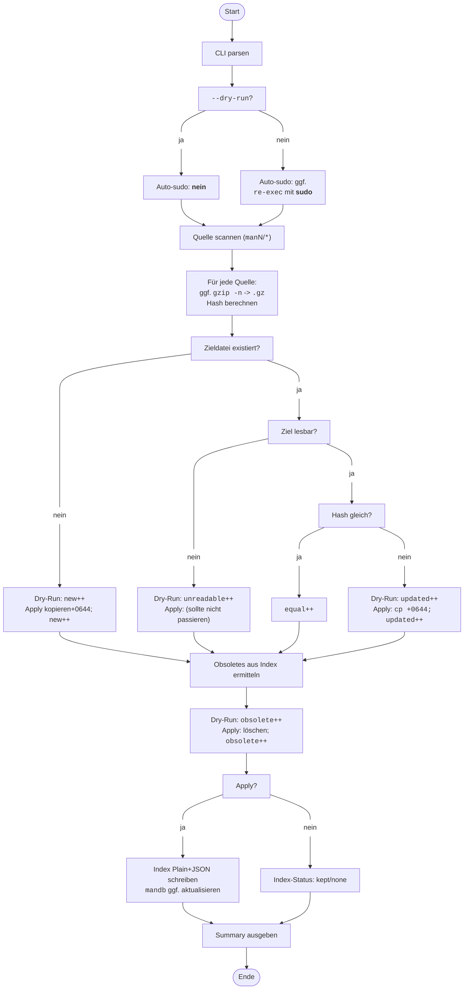

## Flowchart

```mermaid
flowchart TB
  start@{ shape: stadium, label: "Start" }
  --> cliParsen@{shape: rect, label: "CLI parsen"}
  -->isDryRun@{shape: rect, label: "<tt>--dry-run</tt>?"}
  --- isYes1@{ shape: text, label: "ja" }
  --> autoSudoNo@{shape: rect, label: "Auto-sudo: **nein**"}
  isDryRun --- isNo1@{ shape: text, label: "nein" } --> autoSudoGgf@{shape: rect, label: "Auto-sudo: ggf.<br/><tt>re-exec</tt> mit **sudo**"}
  autoSudoNo --> srcScanning@{shape: rect, label: "Quelle scannen (<tt>man</tt>N/<tt>*</tt>)"}
  autoSudoGgf --> srcScanning
  forEachSource -->targetExists@{shape: rect, label: "Zieldatei existiert?"}
  targetExists --- isNo2@{ shape: text, label: "nein" } ---> dryRunNew@{shape: rect, label: "Dry-Run: new++<br/>Apply kopieren+0644; new++"}
  srcScanning -->forEachSource@{shape: rect, label: "Für jede Quelle:<br/>ggf. <tt>gzip -n</tt> -> <tt>.gz</tt><br/>Hash berechnen"}
  targetExists --- isYes2@{shape: text, label: "ja"} --> targetReadable@{shape: rect, label: "Ziel lesbar?"}
  targetReadable --- isYes3@{ shape: text, label: "ja"} --> hashEqual@{shape: rect, label: "Hash gleich?"}
  targetReadable --- isNo3@{ shape: text, label: "nein"} --> dryRunUnreadable@{shape: rect, label: "Dry-Run: <tt>unreadable++</tt><br/>Apply: (sollte nicht passieren)"}
  hashEqual --- isYes4@{ shape: text, label: "ja" } --> equalPp@{shape: rect, label: "<tt>equal++</tt>"}
  hashEqual --- isNo5@{ shape: text, label: "nein" } --> dryRunUpdated@{shape: rect, label: "Dry-Run: <tt>updated++</tt><br/>Apply: <tt>cp +0644; updated++</tt>"}
  dryRunNew --> obsoletes
  dryRunUnreadable --> obsoletes
  equalPp --> obsoletes
  dryRunUpdated --> obsoletes
  obsoletes@{shape: rect, label: "Obsoletes aus Index ermitteln"} --> dryRunObsolete@{shape: rect, label: "Dry-Run: <tt>obsolete++</tt><br/>Apply: löschen; <tt>obsolete++</tt>"}
  dryRunObsolete --> apply@{shape: rect, label: "Apply?"}
  apply --- isYes6@{ shape: text, label: "ja" } --> indexPlainJson@{shape: rect, label: "Index Plain+JSON schreiben<br/><tt>mandb</tt> ggf. aktualisieren"}
  apply --- isNo6@{ shape: text, label: "nein" }  --> indexState@{shape: rect, label: "Index-Status: kept/none"}
  indexPlainJson --> summaryOutput@{shape: rect, label: "Summary ausgeben"}
  indexState --> summaryOutput
  summaryOutput --> ende@{shape: stadium, label: "Ende"}
```

---
