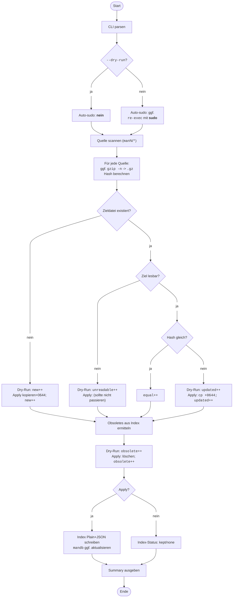

# Dokumentation — `manpages-install` (v0.2.6)

Spiegelt Manpages aus `~/code/bin/shellscripts/man` nach `/usr/local/share/man`.
Unterstützt **Dry-Run**, **Auto-sudo** (nur im Apply-Modus), schreibt bei Apply **immer** einen **Plain-Index** *und* einen **JSON-Index**, aktualisiert optional `mandb` und gibt eine **kompakte, ausgerichtete Summary** aus.

## Features

- **Quellbaum**: beliebige `man*`-Sektionen (z. B. `man1/`, `man5/`), Dateien gzipped oder unkomprimiert.
- **Zielbaum**: `/usr/local/share/man` (Standard).
- **Konsistentes Spiegeln**:
  - Unkomprimierte Quellen werden **deterministisch** nach `.gz` gepackt (`gzip -n`).
  - Vergleiche via `sha256sum` (fehlertolerant).
  - **Neu**, **aktualisiert**, **identisch**, **obsolet** sauber gezählt.
- **Sicher**:
  - **Dry-Run** liest nur; kein Schreiben/`sudo`.
  - **Apply** hebt sich bei Bedarf automatisch auf `sudo` an und setzt Zielrechte auf `0644`.
- **Index**:
  - Plain: `<dst>/.mirror-manpages-install.index` (ein Pfad pro Zeile).
  - JSON: `<dst>/.mirror-manpages-install.index.json` (mit Metadaten + `files[]` inkl. `hash`, `size`).
  - **Apply schreibt immer beide**; Dry-Run schreibt nie (Status: `kept`/`none`).
- **Robust**:
  - Toleriert nicht lesbare Ziel-Dateien im Dry-Run und weist sie als
    `existing (am Ziel nicht lesbar)` aus.
  - Prüft und erklärt fehlende `manN`-Sektionsordner im Ziel (Hinweiszeilen).

---

## Aufruf

```bash
manpages-install [--dry-run | --apply] [--src=PATH] [--dst=PATH]
                 [--index=FILENAME] [--mandb=yes|no] [--help|--version]
```

## Optionen

<style>
    td {vertical-align: top;}
</style>

| Option                       | Beschreibung                                |
| ---------------------------- | -------------------------------------------------------------------------------------- |
| `‑‑dry-run` | Nur Vorschau; **keine** Schreibzugriffe, **kein** `sudo`.<br/>Summary mit Konjunktiv: „würde installieren/überschreiben“ und ggf. `existing (am Ziel nicht lesbar)`. |
| `‑‑apply` | *(Default)* Tatsächliches Spiegeln. Hebt sich **automatisch** auf `sudo` an, falls Ziel nicht schreibbar.<br/>Schreibt **Plain**- und **JSON**-Index, setzt Datei-Rechte `0644`, optional `mandb -q`. |
| `‑‑src=PATH` | *(Default: `~/code/bin/shellscripts/man`)*<br/>Wurzel der Quellen; nur Dateien unter `man*`-Verzeichnissen werden berücksichtigt. |
| `‑‑dst=PATH` | *(Default: `/usr/local/share/man`)*<br/>Ziel-Manpath. |
| `‑‑index=FILENAME` | *(Default: `.mirror-manpages-install.index`)*<br/>Basisname des Plain-Index im Ziel; JSON liegt daneben mit Suffix `.json`. |
| `‑‑mandb=yes\|no` | *(Default: `yes`)*<br/>`mandb` nach Apply aktualisieren (leise). Im Dry-Run: `would-update`. |
| `‑‑help`,<br/>`‑‑version` | Hilfe bzw. reine Versionsausgabe. |

---

## Ausgabe (Beispiele)

**Dry-Run:**

```bash
manpages-install v0.2.6
target(s):
src:   ~/code/bin/shellscripts/man
dst:   /usr/local/share/man
note:  missing section dirs at dst (dry-run): man1
scan:  files:        3
apply: mode:         dry-run
copy:  equal (identisch):                         0
       new (würde installieren):                  3
       updated (würde überschreiben):             0
       existing (am Ziel nicht lesbar):           0
prune: obsolete (würde löschen):                  0
index: plain:   kept:    /usr/local/share/man/.mirror-manpages-install.index
       json:    kept:    /usr/local/share/man/.mirror-manpages-install.index.json
mandb:          would-update
```

**Apply:**

```bash
manpages-install v0.2.6
target(s):
src:   ~/code/bin/shellscripts/man
dst:   /usr/local/share/man
scan:  files:        3
apply: mode:         apply
copy:  equal:                                        0
       new:                                          3
       updated:                                      0
prune: obsolete:                                     0
index: plain:   wrote:   /usr/local/share/man/.mirror-manpages-install.index
       json:    wrote:   /usr/local/share/man/.mirror-manpages-install.index.json
mandb:          updated
```

---

## Typische Workflows

```bash
# 1) Vorschau (kein sudo, kein Schreiben)
manpages-install --dry-run

# 2) Spiegeln (schreibt Plain + JSON, aktualisiert mandb)
manpages-install

# 3) Quelle/Ziel explizit setzen
sudo manpages-install --src="$HOME/code/bin/shellscripts/man" --dst="/usr/local/share/man"

# 4) Ohne mandb-Update
sudo manpages-install --mandb=no
```

---

## Exit-Codes

* `0` Erfolg
* `2` Quellverzeichnis nicht gefunden
* `3` Unbekannte Option
* `≠0` bei unerwarteten Fehlern (mit Fehlerzeile dank Trap)

---

## Dateien

* **Quelle**: `~/code/bin/shellscripts/man/manN/*.1[.gz]` (oder `.5`, `.8`, …)
* **Ziel**: `/usr/local/share/man/manN/*.1.gz`
* **Index (Plain)**: `/usr/local/share/man/.mirror-manpages-install.index`
* **Index (JSON)**: `/usr/local/share/man/.mirror-manpages-install.index.json`

---

## Hinweise & Best Practices

* **Sektionen benennen** (`man1/`, `man5/` …) – Top-Level-Dateien ohne `manN` werden ignoriert.
* **Eigene Manpages** zuerst unter `~/code/bin/shellscripts/man/man1/` ablegen,
  dann `manpages-install` ausführen.
* **Leserechte**: Apply setzt `0644`, damit Dry-Run später ohne Root lesen kann.
* **Obsolet-Erkennung**: basiert auf der zuletzt geschriebenen Indexdatei (JSON bevorzugt).

---

## Flowchart

<style>
    tt {color: #D84315;}
</style>



---
