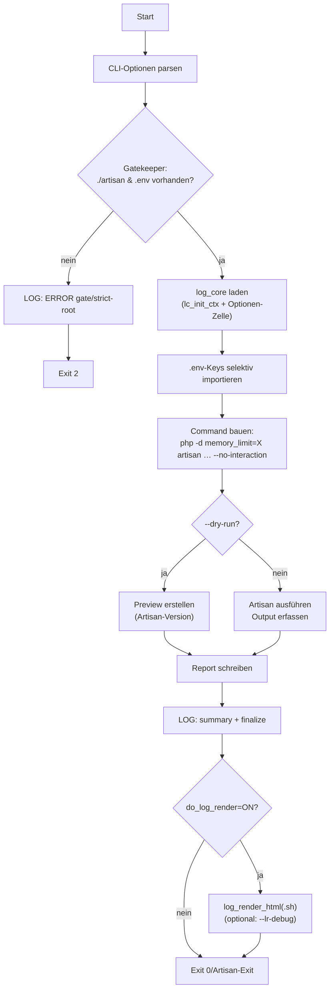

# 1. `artisanx.sh` — Doku (v0.5.2) smarter `php artisan` Wrapper (mit Projekt-Logging & Auto-Render)

**Version:** 0.5.2
**Kurz:** Führt `php artisan …` nur aus dem Projekt-Root aus, schreibt einheitliche Logeinträge (Markdown + JSON) via `log_core.part`, erzeugt optional einen Konsolen-Report und rendert am Ende automatisch die HTML-Logansicht.

---

## 1.1. Features

- **Strict Root / Gatekeeper:** bricht ab, wenn `./artisan` oder `.env` im aktuellen Ordner fehlen.
- **Logging nach Standard:** nutzt `lc_init_ctx`/`lc_log_event_all`/`lc_finalize`. Optionen werden nicht umbrechend in der „Optionen“-Spalte angezeigt (non-breaking hyphen).
- **Debug-Artefakte:** Text/JSON/XTRACE in `~/bin/debug/…`.
- **Konsolen-Report:** speichert Terminal-Ausgabe als `md|txt|json` unter `.wiki/dev/cli/`.
- **Auto-Render:** ruft am Ende `log_render_html(.sh)` auf (abschaltbar).

---

## 1.2. Aufruf

```bash
artisanx [OPTS] -- <artisan args…>
# Beispiel:
artisanx -- --version
```

!!!info > Ohne `-- <args>` wird standardmäßig `php artisan list` ausgeführt.

---

## 1.3. Optionen (Defaults in **Fett**)

- `--dry-run` – Nur Vorschau, kein echter Artisan-Lauf (**aus**)
- `--format md|txt|json` – Format des Konsolen-Reports (**md**)
- `--out <file>` – Ausgabedatei des Reports (default: `.wiki/dev/cli/<ts>_artisanx.<fmt>`)
- `--color auto|always|never` – Farbausgabe (**auto**)
- `--memory <VAL>` – PHP `memory_limit` (**1G** via `ARTISANX_MEMORY` überschreibbar)
- `--capture-lines <N>` – Zeilen im Report-Preview (**120**)
- `--do-log-render=ON|OFF` – HTML-Log nachlaufend rendern (**ON**)
- `--render-delay=<sec>` – Wartezeit vor Render (**1**)
- `--debug=OFF|ON|TRACE` – Debuglevel (**OFF**)
- `--lr-debug=OFF|ON|TRACE` – Debuglevel nur für log_render_html(.sh) (OFF)
- `--version` / `--help`

---

## 1.4. Verhalten & Logik

1. **Argumente parsen**, Debug aktivieren (optional XTRACE).
2. **Gatekeeper:** prüft Projekt-Root (`./artisan`, `.env`).
3. **log\_core laden** (falls vorhanden) → `lc_init_ctx` + **Optionen-Zelle** (non-breaking `--flags`).
4. **Selektiver ENV-Import** aus `.env` (APP\_ENV/APP\_URL/DB\_\*), **ohne** nacktes `export`.
5. **Command bauen:** `php -d memory_limit=<…> artisan … --no-interaction`.
6. **Run:**
   - **Dry-Run:** kein echter Lauf, kurze Info (Version) in Report.
   - **Real:** Ausführen, stdout/stderr erfassen, Preview (erste *N* Zeilen) in Report.
7. **Report speichern** (`md|txt|json`).
8. **Summary loggen**; `lc_finalize`.
9. **Auto-Render (optional):** `log_render_html` oder `log_render_html.sh`.

---

## 1.5. Dateien & Pfade

- Konsolen-Reports: `.wiki/dev/cli/`
  - `artisanx_console_<YYYY-MM-DD_HHMMSS>.md` (vollständiger Output)
  - `<ts>_artisanx.md|txt|json` (Kurzreport)
  - `last.<fmt>`
- Debug:
  - `~/bin/debug/artisanx.debug.log`
  - `~/bin/debug/artisanx.debug.jsonl`
  - `~/bin/debug/artisanx.xtrace.log` (bei `--debug=TRACE`)
- Projekt-Logs:
  - Markdown/JSON je nach `log_core.part`-Konfiguration (`.wiki/logs/...`)

---

## 1.6. Beispiele

```bash
# Liste aller Artisan-Befehle (Default):
artisanx

# Hilfe als Markdown-Report + Auto-Render
artisanx --format md -- --help

# Migration nur simulieren (kein echter Lauf):
artisanx --dry-run -- --migrate

# Erhöhtes Memory + TRACE-Debug + späteres HTML-Render
artisanx --memory 2G --debug=TRACE --render-delay=2 -- --queue:work
```

---

## 1.7. Exit-Codes

- `0` – Erfolgreich
- `2` – Gatekeeper/Usage (Projekt-Root fehlt, Format ungültig, …)
- `>0` – Exit-Code von `php artisan` (bei Real-Run)

---

## 1.8. Troubleshooting

- **Viele `declare -x` Zeilen?**
  Fix in v0.5.2: kein nacktes `export` mehr. Tritt das erneut auf, prüfe Shell-Aliases/Init-Skripte.
- **Keine Logeinträge?**
  `~/bin/parts/log_core.part` fehlt oder export-Variablen (`SCRIPT_NAME`, `SCRIPT_VERSION`) werden überschrieben.
- **HTML wird nicht gerendert?**
  `log_render_html`/`.sh` nicht im `PATH` **oder** `--do-log-render=OFF`.

---

## 1.9. Changelog (Kurz)

- **0.5.2** – Fix `declare -x`-Spam; sicherer ENV-Import aus `.env`.
- **0.5.1** – Array-Längenprüfung korrigiert; `endesac`→`esac`.
- **0.5.0** – log\_core-Integration (Optionen-Zelle, Start/Run/Summary), Debug-Artefakte, Auto-Render.

---

## 1.10. Flowchart



---

*Last updated: 2025-09-04 20:00*

---
