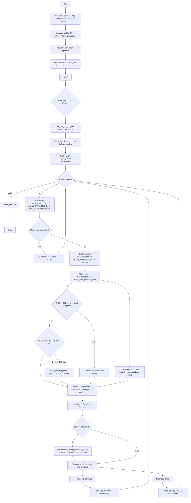

# log\_render\_html – Doku (v0.6.6)

## Kurzüberblick

`log_render_html.sh` rendert die tagesaktuelle Markdown-Logdatei `LOG-YYYYMMDD.md` zu HTML – sowohl **im Projekt** als auch in **\~/bin** – und bindet CSS nach einer **Auto-Policy** ein (deine Styles bevorzugt, sonst Pandoc-Default). Es räumt Pandoc-Artefakte auf (z. B. `<colgroup>`) und wrappt Tabellen für horizontales Scrollen.

## Features

* **Zwei Wurzeln:** Projekt-Root (per `.env` ermittelt) **und** `~/bin`.
* **Auto-CSS-Policy:**
  – Wenn `.markdownpdf-*.css` oder `.shell_script_styles.logs.css` in `/.wiki/logs` existieren → **diese** Styles verwenden (standard: **inline** eingebettet).
  – Sonst → **Pandoc-Default-CSS**.
* **HTML-Aufräumen:**
  Entfernt `<colgroup>…</colgroup>`, `style="width:%"` aus Tabellen/Spalten und wrappt **jede Tabelle** in `<div class="overflowx">…</div>`.
* **Kein Syntax-Highlight** (standard) → kein extra CSS nötig.
* **Logging (über `log_core.part`):** Start-Event + je Root ein „render html“-Event, inkl. CSS-Kette (Modus + Dateinamen).

## Voraussetzungen

* `pandoc` installiert
* (Optional) `~/bin/parts/log_core.part` mit **lc\_init\_ctx**, **lc\_log\_event\_all**, **lc\_finalize**, **lc\_set\_opt\_cell**
* Projekt-Root mit `.env` (für die Projekt-Seite)

## Aufruf & Optionen

```bash
log_render_html.sh [--all] [--root=PATH] [--date=YYYY-MM-DD]
                   [--css=auto|inline|link|none]
                   [--no-default-css|--with-default-css]
                   [--keep-table-widths] [--no-strip-md-style]
                   [--keep-colgroup] [--no-wrap-tables]
                   [--highlight|--no-highlight]
                   [--debug=OFF|ON|TRACE] [--version] [--help]
```

**Defaults (Autopolicy)**

* CSS: **auto** (eigene CSS vorhanden → **inline**; sonst Pandoc-Default)
* Default-CSS: **auto** (nur wenn keine eigenen CSS existieren)
* Strip Markdown `<style>…</style>`: **an**
* Strip Tabellenbreiten (`style="width:%"`): **an**
* Entferne `<colgroup>`: **an**
* Wrap Tabellen: **an** (`<div class="overflowx">…</div>`)
* Highlighting: **aus**

**Beispiele**

```bash
# Standardlauf (Projekt + ~/bin)
log_render_html.sh

# Nur für einen Root
log_render_html.sh --root=~/code/mein_projekt

# CSS-Kette verlinken statt inline einbetten
log_render_html.sh --css=link

# Pandoc-Default-CSS erzwingen (auch wenn eigene vorhanden sind)
log_render_html.sh --with-default-css

# Debug/Trace
log_render_html.sh --debug=TRACE
```

## Ein-/Ausgabeorte

* **Markdown-Quelle:** `<root>/.wiki/logs/YYYY/LOG-YYYYMMDD.md`
* **HTML-Ziel:** `<root>/.wiki/logs/YYYY/LOG-YYYYMMDD.html`
* **CSS-Suchpfad:** `<root>/.wiki/logs/`
  – `.markdownpdf-*.css` (alphabetisch sortiert)
  – `.shell_script_styles.logs.css` (am Ende)

## CSS-Einbindung (Autopolicy)

* **Eigene CSS vorhanden** → verwendet **nur** diese (Default: **inline** via `--embed-resources`; alternativ `--css=link`).
* **Keine eigenen CSS** → **Pandoc-Default-CSS**.
* In den Logs („Skript-Meldungen“) siehst du:

  ```
  CSS:&nbsp;1&nbsp;(inline)&nbsp;`.shell_script_styles.logs.css`
  <br />CSS:&nbsp;2&nbsp;(inline)&nbsp;`.markdownpdf-markdown.css`
  ```

  oder `CSS: Pandoc-Default`.

## HTML-Nachbearbeitung

* Entfernt komplette `<colgroup>…</colgroup>`-Blöcke (Standard).
* Entfernt `style="…width:%…"` aus `<table>`/`<col>` (Standard).
* Wrappt **jede** `<table>` in `<div class="overflowx">…</div>` (Standard).

## Logging (über `log_core.part`)

* **Version-Spalte:** via export (`SCRIPT_VERSION`) korrekt gesetzt.
* **Optionen-Spalte:** alle CLI-Args (non-breaking) jeweils in eigener Zeile.
* **Events:**

  * **Begin:** `render/start` mit Policy/Flags (`strip-md-style`, `wrap-tables`, …).
  * **Je Root:** `render/html` mit Root-Pfad & CSS-Kette.
  * **Finalize:** am Ende.

## Debugdateien

```
~/bin/debug/log_render_html.debug.log
~/bin/debug/log_render_html.xtrace.log   # nur bei --debug=TRACE
```

## Exit-Codes

* `0` Erfolg (für beide Roots)
* `64` Falsche/Unbekannte Option
* `127` Fehlende Abhängigkeit (`pandoc`)
* `1` Pandoc-Fehler beim Rendern eines Roots (der andere kann trotzdem erfolgreich sein)

## Tipps

* Wenn du in den Markdown-Logs bereits `<style>…</style>` eingebettet hast, übernimmt `--no-strip-md-style` deren Inhalt (kann unerwünschte Defaults reaktivieren).
* Für maximale Portabilität in HTML: **inline** (Default) lassen – dann ist alles in **einer** Datei.

---

