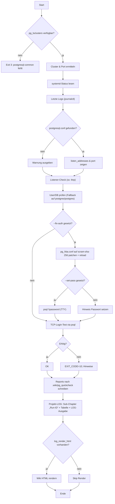

# `pg_quickcheck.sh` — Doku (v0.5.4)

---

!!!info PostgreSQL-Quickdiagnose für WSL/Ubuntu (optimiert für VS Code Remote WSL).
    Aktuelle Referenzversion: **v0.5.4**

## Was macht das Skript?

* Ermittelt aktiven **PostgreSQL-Cluster** (per `pg_lsclusters`)
* Prüft **systemd-Status** & **Journal-Logs**
* Liest zentrale **Konfig-Parameter** (`listen_addresses`/`port`)
* Checkt, ob Postgres **auf TCP lauscht**
* Validiert **User/DB** und führt einen **TCP-Login-Test** via `psql` aus
* (Optional) **Auth-Fix**: `pg_hba.conf` → `scram-sha-256` für `127.0.0.1`/`::1`, plus Passwort-Setup
* Schreibt **Reports** nach `<project>/.wiki/pg_quickcheck/` (`latest.md`, `latest.json`, `history.jsonl`)
* Ergänzt das Tages-**Projekt-LOG** unter `<project>/.wiki/logs/YYYY/LOG-YYYYMMDD.md`
  → eigene **Run-ID**-Sektion mit Tabellen-Header; zusätzliche Spalte **„LOG-Ausgabe“** enthält Backtick-Pfad(e) zu den Resultaten
* (Best effort) **HTML-Render** des Wiki via `log_render_html`

---

## Voraussetzungen

- **Ubuntu (WSL)** mit:
  - `postgresql-common` (liefert `pg_lsclusters`)
  - `psql` (PostgreSQL Client)
  - `systemd` + `journalctl`
  - `ss` (iproute2)
- Für `--fix-auth`: `sudo`-Rechte (schreibt `pg_hba.conf` & `systemctl reload`)

---

## Aufruf & Optionen

```bash
pg_quickcheck.sh [--user NAME] [--db NAME] [--port N] [--unit UNIT]
                 [--fix-auth] [--set-pass]
                 [--no-wiki] [--no-projlog]
                 [--verbose] [--version] [--help]
```

**Wichtigste Flags**

- `--user/--db`  User/DB für den TCP-Test (Default: `$USER` bzw. wie `--user`)
- `--port` / `--unit`  überschreiben erkannte Werte
- `--fix-auth`  setzt in `pg_hba.conf` **scram-sha-256** für `127.0.0.1/32` und `::1/128` (Backup inklusive)
- `--set-pass`  öffnet **interaktiven** Passwort-Prompt (`psql \password`) für den Ziel-User
- `--no-wiki`  unterdrückt Report-Dateien
- `--no-projlog`  unterdrückt Eintrag im Projekt-LOG
- `--verbose`  zeigt intern ausgeführte Kommandos mit rotem Prompt (`$`)

---

## Output-Struktur

### Reports (maschinen- & menschenlesbar)

- `<project>/.wiki/pg_quickcheck/latest.md` – kompakter Markdown-Report
- `<project>/.wiki/pg_quickcheck/latest.json` – strukturierte Daten
- `<project>/.wiki/pg_quickcheck/history.jsonl` – Append-Historie (eine JSON-Zeile pro Run)

**JSON-Felder (Auszug)**

```json
{
  "run_id": "20250907T174455Z-12345",
  "timestamp": "2025-09-07T19:45:00+02:00",
  "host": "127.0.0.1",
  "port": 5432,
  "cluster": { "version": "17", "name": "main", "status": "online" },
  "unit": { "name": "postgresql@17-main", "is_active": "active" },
  "config": { "path": "/etc/postgresql/17/main/postgresql.conf", "listen_port_lines": "..." },
  "tcp_listener": "...",
  "test": { "user": "postgres", "db": "postgres", "tcp_ok": true, "exit_code": 0 },
  "actions": { "fix_auth": false, "set_pass": false },
  "argv": "--verbose",
  "logs_tail": "..."
}
```

### Projekt-LOG (Markdown)

- `<project>/.wiki/logs/YYYY/LOG-YYYYMMDD.md`
- Pro Skriptlauf: **„Run-ID“-Sub-Chapter** → Tabellen-Header → Tabellenzeile(n)
- Spalte **„LOG-Ausgabe“** zeigt Backtick-Pfad(e) auf `latest.md`/`latest.json`

Beispielzeile:

```
| 19:47:12 | `pg_quickcheck.sh` | 0.5.4 | `--verbose` | pg | tcp-test | auto | pg, check | ✅ | 183 | 0 | gunreip | Host=127.0.0.1; Port=5432 | `Unit=postgresql@17-main; listen=...` | `/path/.wiki/pg_quickcheck/latest.md`<br/>`/path/.wiki/pg_quickcheck/latest.json` |
```

---

## Beispiele

```bash
# Standarddiagnose mit Reports + Projekt-LOG
pg_quickcheck.sh --verbose

# Auth sauber fixen + Passwort setzen (TTY) + Diagnose
pg_quickcheck.sh --fix-auth --set-pass --user [username] --db [secure_password] --verbose

# Nur schnelle Prüfung ohne Dateien
pg_quickcheck.sh --no-wiki --no-projlog
```

---

## Exit-Codes

- `0` – OK (Skript lief durch; TCP-Test kann intern trotzdem ❌ sein, siehe JSON/LOG)
- `3` – `pg_lsclusters` fehlt (Paket `postgresql-common` nicht installiert)
- `4` – `psql` nicht gefunden
- `10` – **TCP-Login fehlgeschlagen** (Auth/Port/Listen-Adresse prüfen)
- andere – seltene, durchgelassene Fehlerpfade

---

## Integration mit `log_core.part` & `install_update.part`

- **`log_core.part` (v0.3.0)** stellt zentrale Helfer:
  - `lc_start_run` → eröffnet Run-Gruppe im Tages-LOG (Run-ID + Header)
  - `lc_log_row_v2`/`lc_row_md_v2` → Tabellenzeilen mit Spalte **„LOG-Ausgabe“**
  - `lc_fmt_paths_md` → Pfad(e) als Backticks + `<br/>`
  - `lc_render_html` → ruft `log_render_html` (falls vorhanden)
- **`install_update.part` (v0.2.0)** bietet getrennte Logging-Wrapper:
  - `iu_log_install <path> <sizeB> <dur_ms> [reason] [tags] [log_out_paths…]`
  - `iu_log_update  <path> <oldB> <newB> <dur_ms> [reason] [old_v] [new_v] [tags] [paths…]`
  - `iu_log_version_bump old_v new_v path oldB newB dur_ms [reason] [tags] [paths…]`

!!!info `pg_quickcheck.sh` loggt eigenständig; du kannst aber in anderen Deploy-/Admin-Skripten mit den Parts dieselbe Logik und Tabellenstruktur verwenden.

---

## Security & Hinweise

- `--fix-auth` **patcht** `pg_hba.conf` (Backup wird erstellt) und **reloadet** den Dienst.
- Prüfe vorab deine Sicherheitsvorgaben (insb. in Multi-User-WSL/VMs).
- `--set-pass` erfordert **TTY**; im CI/Headless bitte stattdessen non-interaktiv Passwörter setzen.
- Für VS Code „Database Client“‐Extensions:
  `listen_addresses='localhost'`, korrekter Port (z. B. `5432`), `pg_hba.conf` auf **`scram-sha-256`** für `127.0.0.1/32`/`::1/128`, und ein **gesetztes Passwort** für den DB-User.

---

## Versionierung

- **Patch** (x.y.**1**) für kleine Fixes/Feinschliff
- **Minor** (x.**1**.z) für merkliche Erweiterungen (z. B. neue LOG-Spalte, zentrale Parts)

!!!info Diese Doku bezieht sich auf **v0.5.4** des Skripts und **v0.3.0** / **v0.2.0** der Parts.

---

## Troubleshooting (kurz)

- **`EXIT_CODE=10` / Login ❌**
  - Dienst läuft? → `systemctl status postgresql@<ver>-<main>`
  - `listen_addresses` ⇒ `localhost`
  - `pg_hba.conf` ⇒ Einträge für `127.0.0.1/32` & `::1/128` auf `scram-sha-256`
  - Passwort für Ziel-User gesetzt?
- **`pg_lsclusters` fehlt** → `sudo apt install postgresql-common`
- **`psql` nicht gefunden** → `sudo apt install postgresql-client` (oder passende Version)
- **Keine HTML-Ausgabe** → `log_render_html` ist optional; ggf. Pfad/Funktion bereitstellen

---

## Flow (Mermaid)



Happy checking ✨

---
