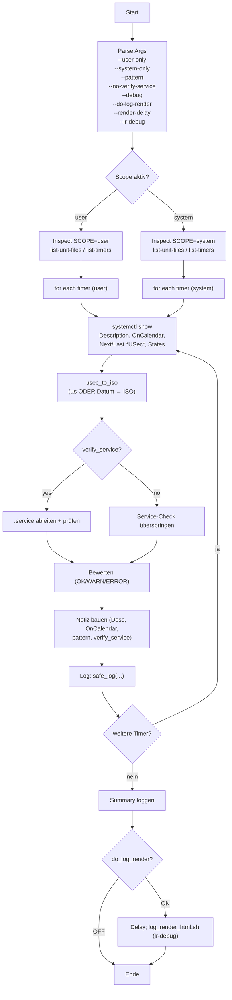

# `systemd_timer_status` - Doku (v0.1.3)

## Zweck

Liefert einen **Status-Report** über systemd-Timer (User/System) und validiert optional die zugehörigen `.service`-Units. Schreibt Logs via `log_core.part` in Markdown/JSON und kann die HTML-Renders automatisch anstoßen.

## Aufruf

```bash
systemd_timer_status [--user-only] [--system-only] \
                     [--pattern <glob>] \
                     [--no-verify-service] \
                     [--debug=OFF|ON|TRACE] \
                     [--do-log-render=ON|OFF] \
                     [--render-delay=<sec>] \
                     [--lr-debug=OFF|ON|TRACE] \
                     [--help] [--version]
```

## Wichtige Optionen

- `--user-only` / `--system-only`
  *Filtert- auf User-Timer bzw. System-Timer. Ohne Angabe: **beides**.
- `--pattern <glob>` (Default `*`)
  Glob-Filter auf Timer-Namen (z. B. `*backup*`).
- `--no-verify-service`
  Überspringt die Prüfung der `.service`-Unit zu einem Timer.
- `--debug=OFF|ON|TRACE`
  Verbose-Level für dieses Skript (TRACE → ausführliches xtrace-Debugfile).
- `--do-log-render=ON|OFF` (Default ON)
  Steuert, ob direkt nach dem Lauf `log_render_html.sh` getriggert wird.
- `--render-delay=<sec>` (Default 1)
  Kurze Pause vor dem Render-Kick (Log-Flush).
- `--lr-debug=OFF|ON|TRACE`
  Debug-Level für den **Renderer** (separat vom Skript-Debug).

## Output/Logging

- **Spalten** (Markdown & JSON):
  `Zeit | Script | Version | Optionen | Sektion | Action | Grund | tags | Ergebnis | Dauer (ms) | Exit | User | Notiz | Skript-Meldungen`
* **Notiz** (mehrzeilig, v0.1.3):

  - `Desc=<code>…</code>`
  - `OnCalendar=<code>…</code>`
  - `pattern=<code>…</code>`
  - `verify_service=<code>0|1</code>`
    (Werte HTML-escaped; kein Backtick — vermeidet Substitution/Word-Splits)
- **Skript-Meldungen**: Kurzinfo, z. B. `enabled=…, active=…, service=… (ok|missing|failed)`.
- **Debug-Artefakte**:

  - `${HOME}/bin/debug/systemd_timer_status.debug.log`
  - `${HOME}/bin/debug/systemd_timer_status.xtrace.log` (bei `TRACE`)

## Verhalten / Checks

- **Scope-Ermittlung**: Listet Timer via `systemctl list-unit-files --type=timer` (Fallback: `list-timers`) je Scope.
- **Filter**: `--pattern` (Shell-Glob) auf Basisname, z. B. `backup_db_hourly.timer`.
- **Detailabfrage** je Timer: `systemctl show` → `Description`, `OnCalendar`, `NextElapseUSecRealtime`, `LastTriggerUSec`, Zustände (`LoadState`, `ActiveState`, `SubState`).
- **Zeitformat**: `usec_to_iso()` akzeptiert **µs** *oder* bereits formatierte Zeitstrings (`Fri 2025-09-05 …`) und konvertiert nach `YYYY-MM-DD HH:MM:SS±zzzz`.
- **Service-Validierung** (Default ON): Leitet aus `<timer>.timer` das `.service` ab; prüft Existenz und Basics (Load/Active/Sub).
- **Tags**: `systemd,timer,<scope>[,calendar]`.

## Exit-Codes

- `0` OK
- `2` Gatekeeper (falls integriert)
- `3` `systemctl` fehlt
- `10` Fehler beim Abfragen

## Beispiele

```bash
# Nur User-Timer, Pattern „*backup*“, mit Service-Check
systemd_timer_status --user-only --pattern "*backup*"

# Nur System-Timer, Services NICHT prüfen, Renderer aus
systemd_timer_status --system-only --no-verify-service --do-log-render=OFF
```

---

## Flow-Diagram



---
